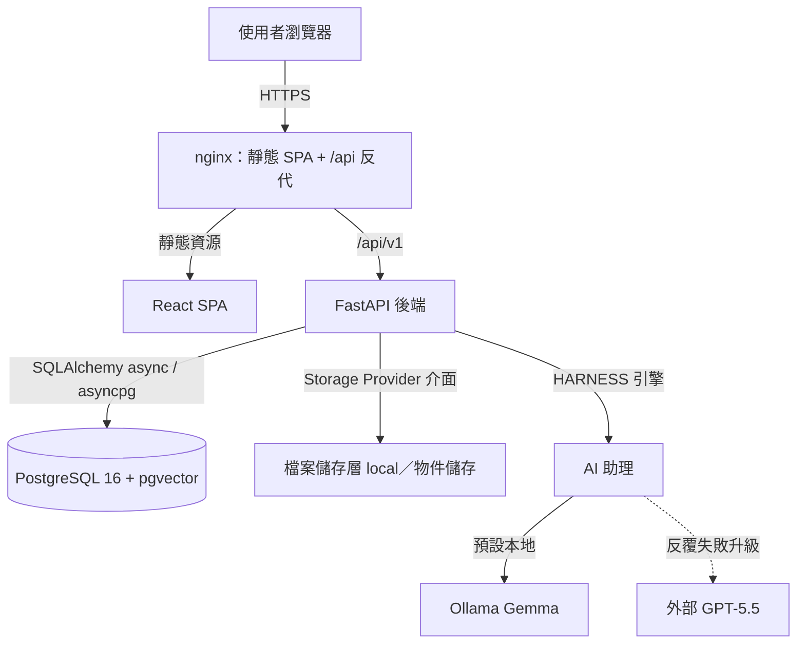
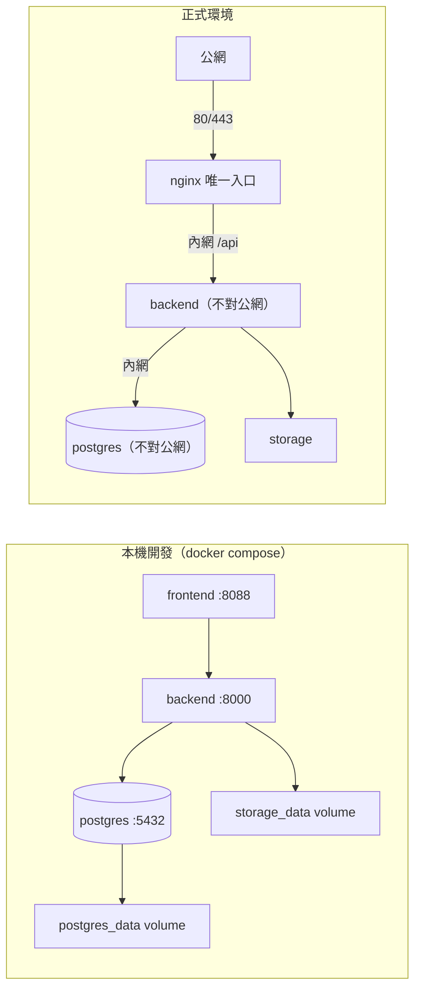
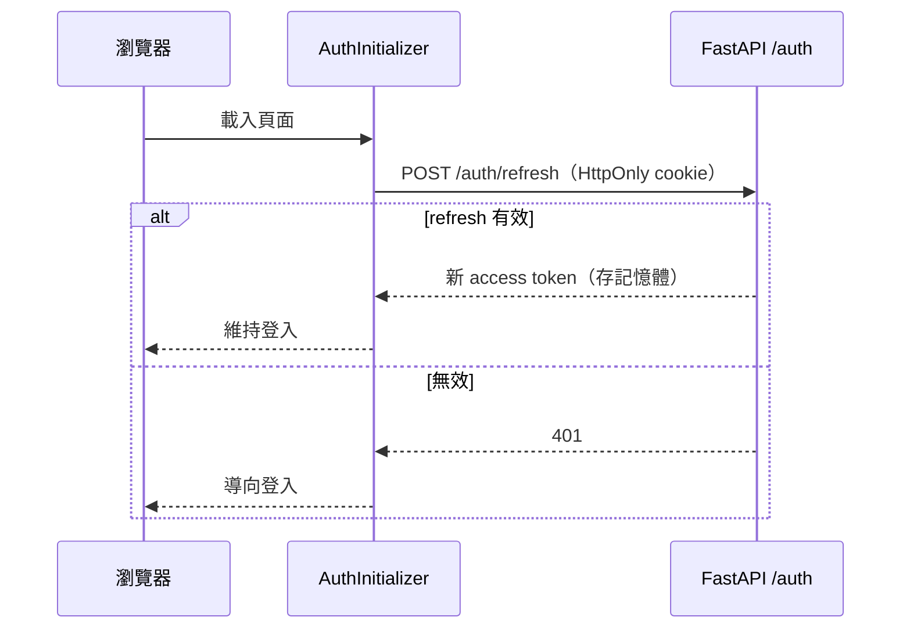
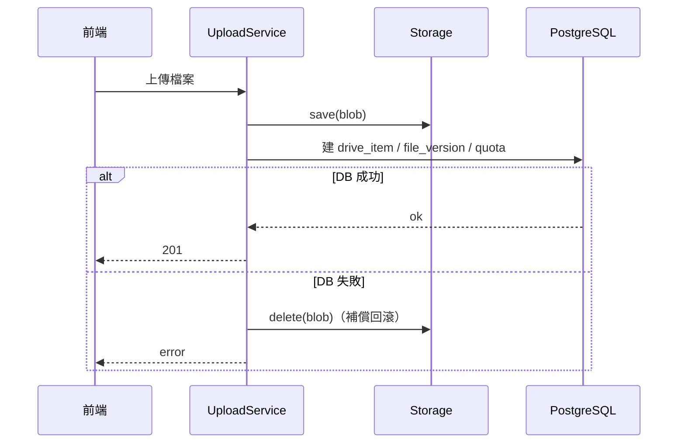
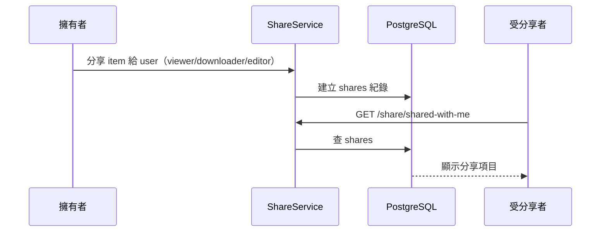
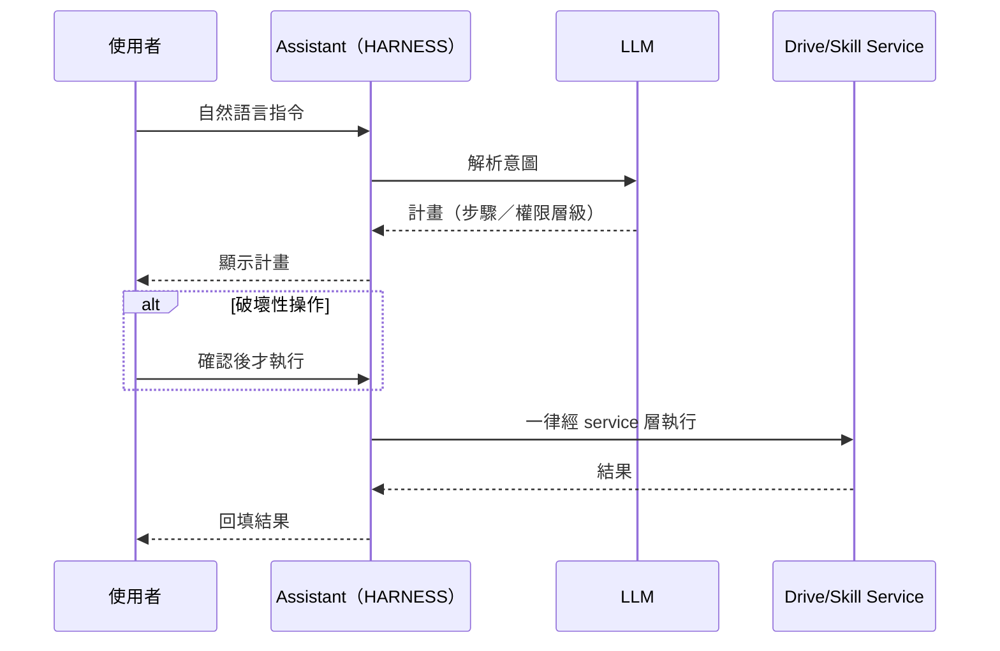
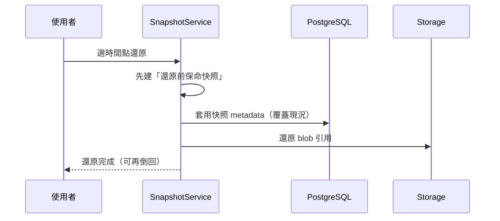
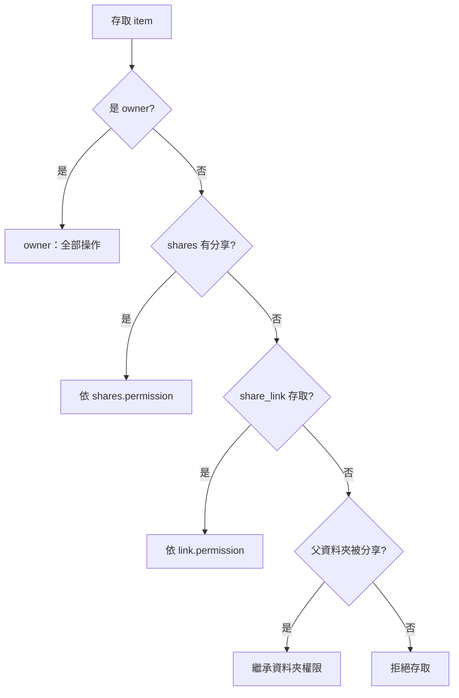
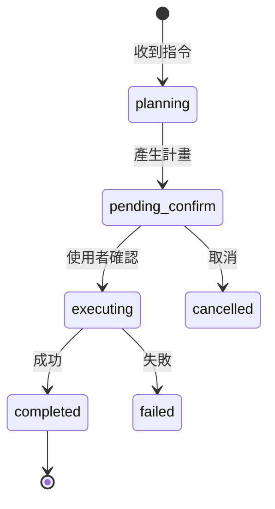
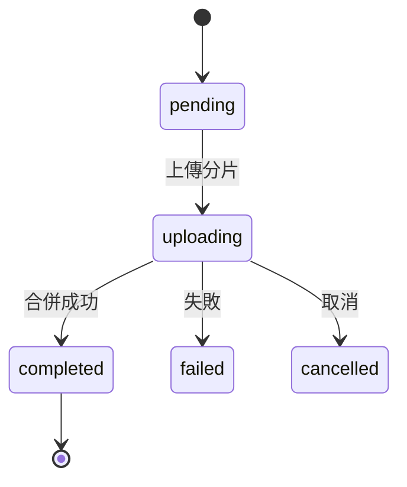

# 雲端硬碟系統詳細設計文件

## 目錄

> 右欄標注每章對應的 proposal.md 主題（需求視角）；兩文件主題順序對齊。

- [1. 文件目的](#1-文件目的) — proposal §1 文件目的
- [2. 本文件範圍](#2-本文件範圍) — proposal §1 文件目的／§4 專案目標
- [3. 整體架構](#3-整體架構) — proposal §7 系統架構
- [4. 已確認設計決策](#4-已確認設計決策) — proposal §8 技術選型
- [5. 前端詳細設計](#5-前端詳細設計) — proposal §9 前端頁面與狀態管理
- [6. 模組拆分原則](#6-模組拆分原則) — proposal §10 後端目錄結構
- [7. 後端核心設計](#7-後端核心設計) — proposal §10 後端目錄結構
- [8. 資料庫詳細設計](#8-資料庫詳細設計) — proposal §11 資料庫設計
- [9. In-App AI Assistant（引擎設計）](#9-in-app-ai-assistant引擎設計) — proposal §12 In-App AI Assistant
- [10. In-App AI Assistant 前端聊天切片](#10-in-app-ai-assistant-前端聊天切片) — proposal §12 In-App AI Assistant
- [11. Assistant 驗證與評分 Harness](#11-assistant-驗證與評分-harness) — proposal §12／§22 測試計畫
- [12. 外部模型接入（Codex/OpenAI）](#12-外部模型接入codexopenai) — proposal §12 In-App AI Assistant
- [13. 時光機（Snapshots）](#13-時光機snapshots) — proposal §13 時光機
- [14. API 詳細設計](#14-api-詳細設計) — proposal §15 API 設計
- [15. 非功能設計](#15-非功能設計) — proposal §17 安全性需求／§18 效能需求
- [16. 錯誤碼設計](#16-錯誤碼設計) — proposal §19 錯誤處理
- [17. 模組獨立測試策略](#17-模組獨立測試策略) — proposal §22 測試計畫
- [18. 開發順序建議](#18-開發順序建議) — proposal §23 開發里程碑
- [19. 驗收對應](#19-驗收對應) — proposal §24 驗收標準
- [20. 第三階段擴充點](#20-第三階段擴充點) — proposal §5.3 第三階段功能
- [21. 未固定參數](#21-未固定參數) — proposal §3 待確認問題
- [22. CI/CD 與部署實作](#22-cicd-與部署實作) — proposal §26 部署與維運計畫
- [23. 結論](#23-結論) — proposal §27 結論

## 1. 文件目的

本文根據 [proposal.md](./proposal.md) 產生，描述雲端硬碟系統的詳細設計。系統前端使用 React，後端使用 FastAPI，資料庫使用 PostgreSQL。

本文目標是把需求文件中的功能拆成可開發、可測試、可替換的模組。每個模組都應盡量維持低耦合，透過明確的 service、repository、API schema 與 storage interface 溝通。

## 2. 本文件範圍

### 2.1 納入範圍

1. 使用者註冊、登入、登出。
2. JWT access token 與 refresh token。
3. 使用者資料與容量統計。
4. 檔案與資料夾中繼資料管理。
5. 一般檔案上傳。
6. 後端串流下載。
7. 檔案基本預覽。
8. 資料夾列表、建立、重新命名、移動。
9. 檔案重新命名、移動、星號、最近列表。
10. 垃圾桶刪除、還原、永久刪除。
11. 搜尋檔案與資料夾名稱。
12. 指定使用者分享。
13. 公開分享連結的擴充設計。
14. 檔案版本資料模型與 service 介面。
15. 操作紀錄。
16. 前端頁面、元件、hook、store、API client 設計。
17. 模組級測試策略。

### 2.2 不納入範圍

1. 管理員後台 UI。
2. OAuth 登入。
3. WebSocket 即時通知。
4. 全文檢索。
5. 防毒掃描實作。
6. 端對端加密。
7. 線上 Office 文件共同編輯。
8. 桌面同步程式。
9. 手機 App。
10. 大檔案分片上傳核心流程實作。

上述項目可保留資料表欄位或抽象接口，但不在本文件中展開成完整實作。

## 3. 整體架構

### 3.1 後端架構

```text
FastAPI app
  core
    config
    security
    dependencies
    exceptions
  routers
    auth
    users
    drive
    upload
    download
    preview
    search
    share
    trash
  services
    auth
    user
    drive
    permission
    quota
    storage
    upload
    download
    preview
    search
    share
    version
    activity_log
  repositories
    user
    token
    drive_item
    file_version
    share
    share_link
    activity_log
  storage
    base
    local
  models
  schemas
```

### 3.2 前端架構

```text
React app
  app
    router
    providers
  api
    client
    authApi
    driveApi
    uploadApi
    shareApi
    searchApi
  pages
    LoginPage
    RegisterPage
    DrivePage
    SharedWithMePage
    RecentPage
    StarredPage
    TrashPage
  components
    layout
    drive
    upload
    preview
    share
    common
  hooks
    useAuth
    useDriveItems
    useUploadQueue
    useShare
  stores
    authStore
    uploadStore
    uiStore
  types
  utils
```

### 3.3 系統架構圖



> metadata 經 PostgreSQL、檔案 binary 經 Storage Provider，兩者分離（見 §8.9）。

### 3.4 部署圖



> 本機映射 `8000/5432` 僅供開發；正式環境僅 nginx 對外（見 DEC-028）。

### 3.5 核心流程時序圖

**登入後 silent refresh**



**檔案上傳（補償式一致性）**



**分享給指定使用者**



**AI 助理執行 workflow**



**時光機還原**



### 3.6 輔助流程圖

**權限判斷（繼承）**



**AI workflow 狀態機**



**upload session 狀態機**



## 4. 已確認設計決策

| 項目 | 決策 |
| --- | --- |
| 文件覆蓋範圍 | MVP + 第二階段功能 |
| 第三階段功能 | 不納入主詳細設計，只保留擴充介面 |
| 前端狀態管理 | Zustand + TanStack Query |
| UI / 樣式 | shadcn/ui + Tailwind CSS |
| JWT 函式庫 | PyJWT |
| 密碼雜湊 | pwdlib[argon2] |
| 檔案儲存 | StorageProvider 抽象介面 + LocalStorageProvider 第一版實作 |
| 下載接口 | MVP 使用 FastAPI StreamingResponse |
| 大檔案分片上傳 | 不納入核心 detailed design，只保留 UploadSession 擴充點 |
| 分享功能 | 納入分層設計；指定使用者分享先做；公開連結、密碼、到期時間作為第二階段可選 |
| 檔案版本紀錄 | 納入資料表與 service 設計；MVP 可只存 v1 |
| 管理員後台 | 不納入主文件，只保留 role 欄位 |
| 文件語言 | 繁體中文 |

> 上述決策的延伸說明（欄位型別與長度、星號權威來源、metadata/storage 一致性、暴露面與 secret 管理等）已敘述於對應章節（§8.0、§8.3.1、§8.9、§9.9、§22）並彙整於 [decisions.md](./decisions.md)（DEC-027、DEC-028），不另立問答清單。

## 5. 前端詳細設計

### 5.0 使用者介面規劃

**整體版面（受保護頁的 App Shell）**

```text
┌──────────────────────────────────────────────────┐
│ TopBar：Logo │ 全域搜尋列 │             個人選單 ▾ │
├───────────┬──────────────────────────┬───────────┤
│ Sidebar   │ Breadcrumbs（路徑導覽）   │ 詳細資訊  │
│ 我的硬碟  │ Toolbar：新增/上傳・檢視  │ 面板      │
│ 與我分享  │ ┌──────────────────────┐  │ （選取項  │
│ 最近      │ │ FileTable / FileGrid │  │  的中繼   │
│ 星號      │ │   檔案/資料夾清單     │  │  資料）   │
│ 垃圾桶    │ │                      │  │           │
│ 儲存空間  │ └──────────────────────┘  │           │
├───────────┴──────────────────────────┴───────────┤
│                     浮動 AI 助理聊天面板（右下角）  │
└──────────────────────────────────────────────────┘
```

**主要頁面與畫面組成**

| 頁面（路由） | 畫面組成 |
| --- | --- |
| 登入／註冊（`/login`,`/register`） | 置中表單、含驗證；無 Shell |
| 我的硬碟（`/`,`/folder/:id`） | 上述 Shell：麵包屑 + Toolbar + 檔案區（列表/格狀）+ 右鍵選單 + 拖曳上傳 |
| 與我分享（`/shared`） | Sidebar + 分享項目清單 |
| 最近／星號／垃圾桶 | 同硬碟版面，資料來源不同；垃圾桶含還原/永久刪除 |
| 預覽（Dialog） | 圖片/PDF/文字/影片/音訊；不支援時顯示下載 |
| 分享（Dialog） | 搜尋使用者 email、設權限、建公開連結（密碼/到期） |
| Skills 管理（`/skills`） | 已安裝技能清單 + 編輯/刪除 |
| 時光機（`/time-machine`） | 快照時間軸 + 唯讀瀏覽 + 還原確認 |
| 帳號設定（`/settings`） | 顯示名稱/Email/密碼修改表單 |

**核心互動規格**

- **檢視切換**：列表／格狀（`FileTable` / `FileGrid`）。
- **多選**：點選 + 框選（空白處拖曳矩形即時選取相交項；空白單擊清除；從卡片拖曳不誤觸框選）。
- **右鍵選單**：開啟/預覽/下載/改名/移動/星號/分享/詳細/垃圾桶；已安裝技能依 manifest 動態掛入。
- **拖曳上傳**：拖檔到檔案區觸發 `UploadDropzone`，進度顯示於 `UploadQueue`。
- **每頁狀態**：Loading／Empty／Error／Permission denied／Offline。

> 元件與狀態的實作細節見以下 §5.1～§5.11；元件清單與整體風格的需求面見 proposal §9。

### 5.1 前端技術組合

1. React + TypeScript。
2. Vite。
3. React Router。
4. TanStack Query 管 server state。
5. Zustand 管 UI state。
6. shadcn/ui + Tailwind CSS。
7. React Hook Form + Zod。

### 5.2 Router 設計

```text
/login
/register
/drive
/drive/folders/:folderId
/shared
/recent
/starred
/trash
/s/:shareToken
```

受保護頁面需透過 `RequireAuth` 包裝。

### 5.2.1 AuthInitializer

App 啟動時（`App.tsx` 最外層）執行一次 silent refresh，解決頁面重載後 access token 因 in-memory 儲存而消失的問題。

責任：

1. 掛載時透過共用的 `refreshAccessToken()` 呼叫 `POST /auth/refresh`。
2. 成功 → 將 access token 寫入 `authStore`，繼續渲染 router。
3. 失敗（cookie 不存在或過期）→ 不做任何事，讓 `RequireAuth` 導向 `/login`。
4. 等待期間回傳 `null`，阻止 router 在結果未定前搶先重導。
5. `AuthInitializer` 與 Axios 401 interceptor 共用 pending promise，避免 StrictMode 或同時請求重複輪替 refresh token。
6. refresh cookie 在 development/test 不設定 `Secure` 以支援本機 HTTP；staging/production 必須設定 `Secure`。

```tsx
// src/app/AuthInitializer.tsx
export function AuthInitializer({ children }) {
  const [ready, setReady] = useState(false)
  useEffect(() => {
    let active = true
    refreshAccessToken().finally(() => {
      if (active) setReady(true)
    })
    return () => { active = false }
  }, [])
  if (!ready) return null
  return <>{children}</>
}
```

### 5.2.2 RequireAuth

責任：

1. 檢查 authStore 是否有 token（`AuthInitializer` 已確保此時結果已定）。
2. 若無 token，導向 `/login`（保留原始 location 供登入後還原）。
3. 若有 token，渲染子路由。
4. 若後續 API 請求收到 401，攔截器自動嘗試 refresh；refresh 失敗則 `clearToken` 並觸發下次路由守衛重導。

### 5.3 API Client 模組

### 5.3.1 責任

1. 統一 base URL。
2. 自動帶上 access token。
3. 處理 401 refresh。
4. 統一解析錯誤格式。
5. 封裝 auth、drive、upload、share、search API。

### 5.3.2 檔案

```text
src/api/client.ts
src/api/authApi.ts
src/api/driveApi.ts
src/api/uploadApi.ts
src/api/shareApi.ts
src/api/searchApi.ts
```

### 5.3.3 可獨立測試項

1. request 會帶 Authorization header。
2. 401 時會呼叫 refresh。
3. refresh 成功後重試原 request。
4. refresh 失敗會清除 authStore。
5. API error 會轉成前端可顯示的錯誤物件。

### 5.4 Auth 前端模組

### 5.4.1 頁面與元件

```text
LoginPage
RegisterPage
AuthForm
```

### 5.4.2 Zustand authStore

```ts
interface AuthState {
  accessToken: string | null;
  refreshToken: string | null;
  user: CurrentUser | null;
  setTokens(tokens: TokenPair): void;
  setUser(user: CurrentUser): void;
  clearAuth(): void;
}
```

### 5.4.3 TanStack Query

| Query/Mutation | 說明 |
| --- | --- |
| `useCurrentUserQuery` | 取得目前使用者 |
| `useLoginMutation` | 登入 |
| `useRegisterMutation` | 註冊 |
| `useLogoutMutation` | 登出 |

### 5.4.4 可獨立測試項

1. email 格式錯誤時表單阻擋送出。
2. 密碼空白時表單阻擋送出。
3. 登入成功後寫入 token。
4. 登出後清除 token。
5. 未登入使用者不可進入 `/drive`。

### 5.5 Layout 模組

### 5.5.1 責任

Layout 模組負責整體操作框架：

1. Sidebar。
2. TopSearchBar。
3. UserMenu。
4. MainContent。
5. DetailsPanel 擴充點。
6. UploadQueue 固定區塊。

### 5.5.2 元件

```text
AppShell
Sidebar
TopBar
TopSearchBar
UserMenu
StorageUsageBar
```

### 5.5.3 uiStore

```ts
interface UiState {
  sidebarCollapsed: boolean;
  viewMode: "list" | "grid";
  selectedItemIds: Set<string>;   // uses Set for O(1) membership checks
  previewItemId: string | null;
  shareItemId: string | null;
  contextMenu: ContextMenuState | null;
  // actions
  selectItem(id: string, multi?: boolean): void;  // multi=true → toggle without clearing
  selectAll(ids: string[]): void;
  clearSelection(): void;
}
```

### 5.5.4 可獨立測試項

1. Sidebar 可切換收合。
2. viewMode 切換後 DrivePage 顯示列表或格狀。
3. 選取檔案後 toolbar 顯示操作。
4. 關閉 preview dialog 後 previewItemId 清空。
5. 全域 CSS（`index.css`）對 `*` 設定 `user-select: none`，徹底禁止任何 UI 文字被滑鼠選取或複製；`input`、`textarea` 以 `user-select: text` 覆寫，保留表單欄位的正常選取能力。

### 5.6 Drive 前端模組

### 5.6.1 頁面

```text
DrivePage
RecentPage
StarredPage
```

### 5.6.2 元件

```text
DriveToolbar
Breadcrumbs
FileTable            — header checkbox (indeterminate) + onSelectAll
FileGrid
FileRow              — checkbox overlays icon on hover; always visible when selected
FileCard             — absolute-positioned checkbox top-left
FileIcon
FileContextMenu      — single-item right-click menu
MultiFileContextMenu — multi-item right-click menu (count label + trash only)
CreateFolderDialog
RenameDialog
MoveDialog
ConfirmTrashDialog   — supports itemNames: string[] for bulk confirmation
```

**多選行為：**
- Checkbox 點擊 (`onCheckboxClick`) 永遠以累積模式加選，不取代已選範圍。
- `useDragSelect` 監聽 `window` 上的 Pointer Events，超過 5 px 移動門檻後顯示 `position:fixed` 選取框。
- 框選可從 `<main>` 內任意空白處啟動（含檔案列表外的 padding 區域）；Sidebar 與 TopBar 不在 `<main>` 內，從那裡開始拖曳不會啟動選框（以 `closest('main')` 判斷）。
- 框選以 `[data-item-id]` 元素的 `getBoundingClientRect()` 判斷是否與選取框相交，因此格狀檔案卡與列表列都支援。
- 框選只使用滑鼠左鍵；新的框選範圍取代既有選取，不要求搭配 Ctrl/Cmd 等鍵盤按鍵。
- `pointerdown` 時取消原生預設行為並呼叫 `removeAllRanges()`；拖曳期間攔截 `selectstart` 防止文字反白。
- 空白處單擊清除選取；從檔案項目、checkbox、button、link 或其他互動控制開始拖曳時不啟動框選。
- 右鍵點擊已選取的多個項目之一 → 顯示 `MultiFileContextMenu`（僅「移至垃圾桶」）。
- 右鍵點擊未選或單選項目 → 顯示 `FileContextMenu`（完整單一操作）。
- `uiStore.selectAll(ids)` 提供 header checkbox 全選功能。
- 批次移至垃圾桶後自動 `clearSelection()`。

### 5.6.3 Hooks

```ts
useDriveItems(parentId, sort, order, page, pageSize)
useFolderItem(folderId)      // GET /drive/items/{id} — current folder's metadata
useFolderAncestors(folderId) // GET /drive/items/{id}/ancestors — ordered [root → parent]
useCreateFolder()
useRenameItem()
useMoveItem()
useSetStarred()
useMoveToTrash()
useRecentItems()
useDragSelect(containerRef, onSelectIds, onClear)
```

`useFolderItem` + `useFolderAncestors` 一起驅動 DrivePage 的 Breadcrumbs 元件，並提供 ArrowLeft 返回按鈕所需的 `parent_id`。

### 5.6.4 Query Key 設計

```ts
["drive", "items", parentId]         // folder contents
["drive", "item", id]                // single item metadata
["drive", "ancestors", id]           // ancestor chain for breadcrumbs
["drive", "recent"]
["drive", "starred"]
```

### 5.6.5 更新策略

1. 建立資料夾成功後 invalidate `drive-items`。
2. 重新命名成功後 invalidate 相關列表。
3. 移動成功後 invalidate 原資料夾與目標資料夾。
4. 星號成功後 invalidate starred 與目前列表。
5. 移至垃圾桶後 invalidate drive、trash、recent。

### 5.6.6 可獨立測試項

1. 空資料夾顯示 empty state。
2. loading 時顯示 skeleton。
3. API error 時顯示錯誤狀態。
4. 點擊資料夾會進入該 folder route。
5. 點擊檔案會開啟 preview。
6. 右鍵選單會根據 item_type 顯示可用操作。

### 5.7 Upload 前端模組

### 5.7.1 責任

1. 選擇檔案。
2. 拖曳上傳。
3. 呼叫 `/upload/simple`。
4. 顯示進度。
5. 顯示成功、失敗、取消狀態。

### 5.7.2 uploadStore

```ts
interface UploadTask {
  id: string;
  file: File;
  parentId: string | null;
  progress: number;
  status: "pending" | "uploading" | "completed" | "failed" | "cancelled";
  errorMessage?: string;
}

interface UploadState {
  tasks: UploadTask[];
  addTasks(files: File[], parentId: string | null): void;
  updateProgress(id: string, progress: number): void;
  markCompleted(id: string): void;
  markFailed(id: string, message: string): void;
  removeTask(id: string): void;
}
```

### 5.7.3 元件

```text
UploadButton
UploadDropzone
UploadQueue
UploadTaskItem
```

### 5.7.4 可獨立測試項

1. 選擇檔案後建立 UploadTask。
2. 拖曳檔案到螢幕任意位置（包含 Sidebar、TopBar）均會建立 UploadTask；`UploadDropzone` 使用 `window` 全域 drag 事件並以 `position:fixed` overlay 覆蓋整個視窗。
3. 上傳中顯示進度。
4. 上傳成功後檔案列表刷新。
5. 上傳失敗後顯示錯誤訊息。

### 5.8 Preview 前端模組

### 5.8.1 責任

1. 呼叫 preview API。
2. 根據 preview_type 渲染不同 viewer。
3. 不支援預覽時顯示下載操作。

### 5.8.2 元件

```text
PreviewDialog
ImagePreview
PdfPreview
TextPreview
VideoPreview
AudioPreview
UnsupportedPreview
```

### 5.8.3 可獨立測試項

1. image preview 使用 img 顯示。
2. pdf preview 使用 iframe 或 PDF viewer 顯示。
3. text preview 顯示文字內容。
4. unsupported preview 顯示下載按鈕。
5. preview API 錯誤時顯示錯誤狀態。

### 5.9 Share 前端模組

### 5.9.1 責任

1. 開啟分享彈窗。
2. 輸入 target email。
3. 選擇 permission。
4. 建立指定使用者分享。
5. 顯示與移除既有分享。
6. 第二階段支援公開連結、密碼、到期時間。

### 5.9.2 元件

```text
ShareDialog
UserShareForm
PermissionSelect
ShareMemberList
ShareLinkPanel
```

### 5.9.3 Hooks

```ts
useShareWithUser()
useUpdateUserShare()
useRemoveUserShare()
useSharedWithMe()
useCreateShareLink()
```

### 5.9.4 可獨立測試項

1. email 空白不可送出。
2. permission 必須是 viewer、downloader、editor 其中之一。
3. 分享成功後顯示成功狀態。
4. 移除分享後列表更新。
5. 建立公開連結後可複製 URL。

### 5.10 Trash 前端模組

### 5.10.1 頁面與元件

```text
TrashPage
TrashToolbar
RestoreConfirmDialog
PermanentDeleteConfirmDialog
EmptyTrashConfirmDialog
```

### 5.10.2 Hooks

```ts
useTrashItems()
useRestoreItem()
usePermanentDelete()
useEmptyTrash()
```

### 5.10.3 可獨立測試項

1. 垃圾桶列表可顯示已刪除項目。
2. 還原成功後 item 從垃圾桶消失。
3. 永久刪除前必須確認。
4. 清空垃圾桶前必須確認。

### 5.11 Search 前端模組

### 5.11.1 責任

1. 上方搜尋列輸入。
2. debounce。
3. 呼叫搜尋 API。
4. 顯示搜尋結果。
5. 支援檔案/資料夾類型篩選。

### 5.11.2 Hooks

```ts
useSearchItems(query, filters, page, pageSize)
```

### 5.11.3 導覽行為

- 從非 `/search` 頁進入搜尋時，將來源路徑存入 navigate state `{ from: pathname }`。
- 後續 replace 導航（每次 keystroke）攜帶同一份 state 向前傳遞。
- 清空搜尋欄時讀取 `state.from` 精準導回，避免 `navigate(-1)` 因中間 replace history 退到上一個搜尋狀態。

### 5.11.4 可獨立測試項

1. 輸入關鍵字後 debounce 呼叫 API。
2. 清空關鍵字後不查詢，並導回搜尋前頁面。
3. 搜尋結果可開啟 preview 或資料夾。
4. 搜尋錯誤時顯示錯誤狀態。

## 6. 模組拆分原則

### 6.1 基本原則

1. 每個模組只處理自己的核心責任。
2. Router 不直接操作資料庫。
3. Service 負責商業邏輯與跨 repository 協調。
4. Repository 只負責資料存取。
5. StorageProvider 只負責檔案本體讀寫，不負責資料庫。
6. 權限檢查集中在 PermissionService，不分散在各 router。
7. 容量檢查集中在 QuotaService。
8. 前端 server state 由 TanStack Query 管理。
9. 前端 UI state 由 Zustand 管理。
10. 每個模組都要能用 mock repository 或 mock storage 獨立測試。

### 6.2 模組依賴方向

```text
Router
  -> Service
    -> Repository
    -> StorageProvider
    -> PermissionService
    -> QuotaService

Repository
  -> PostgreSQL

StorageProvider
  -> Local file system
```

Repository 不可呼叫 Service。StorageProvider 不可呼叫 Repository。前端元件不可直接呼叫 fetch，必須透過 api client 或 hook。

## 7. 後端核心設計

### 7.1 Core 模組

### 7.1.1 責任

Core 模組提供全系統共用能力：

1. 讀取環境變數。
2. 建立資料庫 session dependency。
3. JWT encode/decode。
4. 密碼雜湊與驗證。
5. 統一錯誤格式。
6. 取得目前登入使用者。
7. CORS、API prefix、app startup 設定。

### 7.1.2 主要檔案

```text
backend/app/core/config.py
backend/app/core/security.py
backend/app/core/dependencies.py
backend/app/core/exceptions.py
backend/app/core/error_codes.py
```

### 7.1.3 Config 設計

未在需求中明確指定的值都由環境變數提供，不在程式碼中硬編固定值。

```python
class Settings(BaseSettings):
    app_env: str
    api_v1_prefix: str
    database_url: str
    jwt_secret_key: str
    jwt_algorithm: str
    access_token_expire_minutes: int
    refresh_token_expire_days: int
    cors_origins: list[str]
    storage_driver: str
    local_storage_path: str
    max_upload_size_bytes: int
    default_user_quota_bytes: int
```

### 7.1.4 Security 設計

密碼：

1. 使用 `pwdlib[argon2]`。
2. 註冊時只儲存 `password_hash`。
3. 登入時使用 verify。

JWT：

1. 使用 PyJWT。
2. access token 用於 API 驗證。
3. refresh token 用於取得新的 access token。
4. token payload 至少包含 `sub`、`type`、`exp`、`iat`。

```json
{
  "sub": "user_uuid",
  "type": "access",
  "exp": 1780000000,
  "iat": 1779990000
}
```

### 7.1.5 可獨立測試項

1. `hash_password` 產生的結果不可等於原密碼。
2. `verify_password` 對正確密碼回傳 true。
3. `verify_password` 對錯誤密碼回傳 false。
4. access token decode 後可取得 user id。
5. refresh token 不可被當成 access token 使用。
6. 過期 token 會回傳 `UNAUTHORIZED`。

### 7.2 Auth 模組

### 7.2.1 責任

Auth 模組負責：

1. 使用者註冊。
2. 使用者登入。
3. access token 與 refresh token 簽發。
4. refresh token 輪替或撤銷。
5. 登出。
6. 取得目前使用者。
7. 忘記密碼：重設為隨機臨時密碼並寄送 email。

Auth 模組不負責檔案權限，也不處理檔案資料。

### 7.2.2 對外 API

| Method | Path | 說明 |
| --- | --- | --- |
| POST | `/api/v1/auth/register` | 註冊 |
| POST | `/api/v1/auth/login` | 登入 |
| POST | `/api/v1/auth/forgot-password` | 忘記密碼：寄送隨機臨時密碼（防枚舉，恆回傳相同訊息） |
| POST | `/api/v1/auth/refresh` | 刷新 access token |
| POST | `/api/v1/auth/logout` | 登出 |
| GET | `/api/v1/auth/me` | 目前使用者 |

### 7.2.3 Service 介面

```python
class AuthService:
    async def register(self, data: RegisterRequest) -> User
    async def login(self, email: str, password: str) -> TokenPair
    async def forgot_password(self, *, email: str, email_provider: EmailProvider) -> None
    async def refresh(self, refresh_token: str) -> TokenPair
    async def logout(self, refresh_token: str) -> None
    async def get_current_user(self, access_token: str) -> User
```

### 7.2.5 忘記密碼流程

1. 前端 `/forgot-password` 頁送出 email 至 `POST /auth/forgot-password`。
2. `forgot_password()` 正規化 email 後查詢使用者；查無或帳號停用時**靜默結束**（防枚舉）。
3. 否則以 `generate_random_password(10)` 產生隨機 10 碼密碼，呼叫 `UserRepository.reset_password()` 更新 hash 並設定 `users.must_change_password = True`。
4. 透過 `EmailProvider` 寄出含臨時密碼的 email。端點無論結果都回傳相同訊息。
5. 使用者以臨時密碼登入；`CurrentUserResponse.must_change_password=True` 觸發前端提醒 banner。
6. 使用者於帳號設定改密碼時，`UserService.change_password()` → `update_password()` 一併清除 `must_change_password`。

**Email 抽象層（`app/email/`）**：仿照 `StorageProvider` 模式。`EmailProvider` protocol（`send(to, subject, body)`），`ConsoleEmailProvider`（記錄至 log，預設）與 `SMTPEmailProvider`（aiosmtplib，Gmail 等）。`get_email_provider()` factory 依 `EMAIL_PROVIDER` 設定選擇；`smtp` 但未設 `SMTP_HOST` 時 fallback 回 console。SMTP 寄送失敗會被吞下並記錄，以維持端點不可枚舉。

### 7.2.4 Repository 依賴

1. UserRepository
2. RefreshTokenRepository

### 7.2.5 Refresh Token 儲存設計

需求文件提到 refresh token 與登出撤銷，因此需要儲存 refresh token 狀態。

建議資料表：

| 欄位 | 型別 | 說明 |
| --- | --- | --- |
| id | uuid | 主鍵 |
| user_id | uuid | 使用者 |
| token_hash | varchar | refresh token hash |
| expires_at | timestamptz | 到期時間 |
| revoked_at | timestamptz | 撤銷時間 |
| created_at | timestamptz | 建立時間 |

資料庫只保存 refresh token hash，不保存明文 refresh token。

### 7.2.6 錯誤碼

| 情境 | 錯誤碼 |
| --- | --- |
| email 已存在 | `EMAIL_ALREADY_EXISTS` |
| 帳號或密碼錯誤 | `INVALID_CREDENTIALS` |
| token 過期 | `UNAUTHORIZED` |
| refresh token 已撤銷 | `REFRESH_TOKEN_REVOKED` |
| 使用者停用 | `USER_INACTIVE` |

### 7.2.7 可獨立測試項

1. 註冊成功會建立 user。
2. 重複 email 註冊會失敗。
3. 正確帳密登入會回傳 token pair。
4. 錯誤密碼登入會失敗。
5. refresh token 可換取新 access token。
6. logout 後 refresh token 不可再使用。
7. 停用使用者不可登入。

### 7.3 User 與 Quota 模組

### 7.3.1 責任

User 模組負責使用者基本資料。Quota 模組負責容量檢查與統計。

兩者分開是為了讓容量邏輯可被 Upload、Trash、Version 模組共用。

### 7.3.2 UserService 介面

```python
class UserService:
    async def get_by_id(self, user_id: UUID) -> User
    async def get_by_email(self, email: str) -> User | None
    async def update_username(self, user_id: UUID, username: str) -> User
    async def update_email(self, user_id: UUID, email: str) -> User
    async def change_password(self, user_id: UUID, current_password: str, new_password: str) -> None
```

#### 帳號設定 API

| Method | Path | 說明 |
| --- | --- | --- |
| PATCH | `/api/v1/users/me` | 更改 username |
| PATCH | `/api/v1/users/me/email` | 更改 email（已被使用回 409）|
| PATCH | `/api/v1/users/me/password` | 更改密碼（驗證舊密碼，成功回 204）|

### 7.3.3 QuotaService 介面

```python
class QuotaService:
    async def assert_has_space(self, user_id: UUID, size_delta: int) -> None
    async def increase_used_bytes(self, user_id: UUID, size_delta: int) -> None
    async def decrease_used_bytes(self, user_id: UUID, size_delta: int) -> None
    async def recalculate_used_bytes(self, user_id: UUID) -> int
```

### 7.3.4 容量統計規則

1. 一般檔案上傳成功後增加 `used_bytes`。
2. 檔案移入垃圾桶時不立即釋放容量。
3. 永久刪除檔案後釋放容量。
4. 版本紀錄若保存多版，每一版都計入容量。
5. 資料夾本身大小為 0。
6. 容量上限值由 `users.quota_bytes` 決定。

### 7.3.5 可獨立測試項

1. 剩餘容量足夠時 `assert_has_space` 成功。
2. 剩餘容量不足時回傳 `QUOTA_EXCEEDED`。
3. 上傳檔案後 used_bytes 增加。
4. 永久刪除檔案後 used_bytes 減少。
5. 資料夾不影響容量。

### 7.4 DriveItem 模組

### 7.4.1 責任

DriveItem 模組管理檔案與資料夾的中繼資料：

1. 建立資料夾。
2. 列出資料夾內容。
3. 重新命名。
4. 移動。
5. 複製的擴充點。
6. 星號標記。
7. 最近檔案列表。
8. 查詢 item 詳細資訊。

DriveItem 模組不直接處理檔案內容讀寫，檔案本體由 Storage 模組處理。

### 7.4.2 Service 介面

```python
class DriveService:
    async def list_items(
        self,
        user_id: UUID,
        parent_id: UUID | None,
        sort: str,
        order: str,
        page: int,
        page_size: int,
    ) -> Page[DriveItem]

    async def create_folder(
        self,
        user_id: UUID,
        parent_id: UUID | None,
        name: str,
    ) -> DriveItem

    async def rename_item(
        self,
        user_id: UUID,
        item_id: UUID,
        name: str,
    ) -> DriveItem

    async def move_item(
        self,
        user_id: UUID,
        item_id: UUID,
        new_parent_id: UUID | None,
    ) -> DriveItem

    async def set_starred(
        self,
        user_id: UUID,
        item_id: UUID,
        is_starred: bool,
    ) -> DriveItem

    async def get_recent_items(
        self,
        user_id: UUID,
        page: int,
        page_size: int,
    ) -> Page[DriveItem]

    async def get_ancestors(
        self,
        user_id: UUID,
        item_id: UUID,
    ) -> list[DriveItemResponse]
    # Returns ordered [root_folder, ..., direct_parent]; current item excluded.
    # Walks parent_id chain upward; cycle-safe via seen-set guard.
    # Endpoint: GET /api/v1/drive/items/{item_id}/ancestors
```

### 7.4.3 Repository 介面

```python
class DriveItemRepository:
    async def get_by_id(self, item_id: UUID) -> DriveItem | None
    async def list_children(self, owner_id: UUID, parent_id: UUID | None, paging: Paging) -> Page[DriveItem]
    async def create(self, item: DriveItemCreate) -> DriveItem
    async def update_name(self, item_id: UUID, name: str, updated_by: UUID) -> DriveItem
    async def update_parent(self, item_id: UUID, parent_id: UUID | None, updated_by: UUID) -> DriveItem
    async def exists_name_in_parent(self, owner_id: UUID, parent_id: UUID | None, name: str) -> bool

class UserItemPreferenceRepository:
    async def get_preference(self, user_id: UUID, item_id: UUID) -> UserItemPreference | None
    async def upsert_preference(self, user_id: UUID, item_id: UUID, *, is_starred: bool) -> UserItemPreference
    async def get_starred_ids(self, user_id: UUID, item_ids: list[UUID]) -> set[UUID]
```

### 7.4.4 驗證規則

1. 名稱不可為空。
2. 名稱不可包含路徑分隔符。
3. 同一 owner、同一 parent、未刪除項目不可同名。
4. 移動資料夾時不可移到自己的子孫資料夾。
5. 根目錄以 `parent_id = null` 表示。
6. 使用者只能列出自己有權限存取的項目。

### 7.4.5 權限要求

| 操作 | 最低權限 |
| --- | --- |
| list | viewer |
| get detail | viewer |
| create folder | owner 或 editor |
| rename | owner 或 editor |
| move | owner 或 editor |
| set starred | viewer；星號屬於使用者個人偏好 |
| delete to trash | owner 或 editor |

正式星號狀態以 `user_item_preferences.is_starred` 為準；`drive_items.is_starred` 僅為初始 schema 遺留/相容欄位，不作為回應與查詢的權威來源。這樣共享檔案時，每位使用者可有自己的星號狀態，不會互相污染。

### 7.4.6 可獨立測試項

1. 建立根目錄資料夾成功。
2. 建立子資料夾成功。
3. 同層重名失敗。
4. 不同資料夾可有相同名稱。
5. 重新命名後 updated_at 更新。
6. 移動到不存在資料夾失敗。
7. 移動資料夾到自己的子資料夾失敗。
8. 無權限使用者不可 rename。

### 7.5 Permission 模組

### 7.5.1 責任

Permission 模組負責統一判斷使用者對某個 item 的權限。

此模組是 Drive、Upload、Download、Preview、Trash、Share、Version 的共同依賴。

### 7.5.2 權限層級

| 權限 | 值 | 能力 |
| --- | --- | --- |
| owner | 4 | 所有操作 |
| editor | 3 | 修改、移動、上傳新版本 |
| downloader | 2 | 檢視與下載 |
| viewer | 1 | 檢視與預覽 |
| none | 0 | 不可存取 |

### 7.5.3 Service 介面

```python
class PermissionService:
    async def get_permission(self, user_id: UUID, item_id: UUID) -> Permission
    async def assert_can_view(self, user_id: UUID, item_id: UUID) -> None
    async def assert_can_download(self, user_id: UUID, item_id: UUID) -> None
    async def assert_can_edit(self, user_id: UUID, item_id: UUID) -> None
    async def assert_is_owner(self, user_id: UUID, item_id: UUID) -> None
```

### 7.5.4 權限判斷流程

```text
get item
  -> item.owner_id == user_id ?
      yes: owner
      no:
        check direct share
          -> found: share.permission
          -> not found:
             check inherited folder share
               -> found: inherited permission
               -> not found: none
```

公開連結權限由 ShareLinkService 驗證，不混入一般 user permission 判斷。

### 7.5.5 資料夾繼承策略

MVP + 第二階段採用查詢祖先資料夾的方式判斷繼承權限。若資料量變大，可擴充 closure table 或 permission cache。

本文件不指定 ltree 或 closure table，因為需求尚未要求大規模資料夾樹效能優化。

### 7.5.6 可獨立測試項

1. owner 取得 owner 權限。
2. 指定分享 viewer 取得 viewer 權限。
3. 未分享使用者取得 none。
4. 子項目繼承父資料夾權限。
5. editor 可編輯但不等於 owner。
6. viewer 不可下載時，依實際 permission 設計拒絕下載。

### 7.6 Storage 模組

### 7.6.1 責任

Storage 模組負責檔案本體的儲存、讀取與刪除。第一版實作 LocalStorageProvider，未來可替換 MinIO、S3 或 Azure Blob。

Storage 模組不負責：

1. 使用者認證。
2. 權限判斷。
3. 容量判斷。
4. drive_items 建立。
5. 分享邏輯。

### 7.6.2 StorageProvider 介面

```python
from typing import BinaryIO, Protocol


class StorageProvider(Protocol):
    async def save(self, file_stream: BinaryIO, storage_key: str) -> int:
        ...

    async def open_read(self, storage_key: str) -> BinaryIO:
        ...

    async def delete(self, storage_key: str) -> None:
        ...

    async def exists(self, storage_key: str) -> bool:
        ...

    async def get_size(self, storage_key: str) -> int:
        ...
```

`generate_download_url` 暫不作為 MVP 必要接口，因為已確認 MVP 使用 StreamingResponse。未來物件儲存可加回 signed URL。

### 7.6.3 LocalStorageProvider 設計

本機儲存路徑：

```text
{LOCAL_STORAGE_PATH}/{user_id}/{item_id}/{version_no}/{safe_file_name}
```

`storage_key` 不直接使用使用者上傳的原始檔名產生。原始檔名只存在資料庫 `drive_items.name`。

### 7.6.4 安全規則

1. `storage_key` 由後端產生。
2. 禁止 `../` 路徑穿越。
3. LocalStorageProvider 只能讀寫 `LOCAL_STORAGE_PATH` 之下的檔案。
4. 寫入前先寫到 temporary path，成功後再 move 到正式位置。
5. 刪除檔案時只刪除 storage_key 指向的檔案。

### 7.6.5 可獨立測試項

1. save 後 exists 為 true。
2. save 回傳寫入 bytes。
3. open_read 可讀回同樣內容。
4. delete 後 exists 為 false。
5. 非法 storage_key 會被拒絕。
6. 寫入失敗不留下正式檔案。

### 7.7 Upload 模組

### 7.7.1 責任

Upload 模組負責一般檔案上傳流程：

1. 接收 multipart file。
2. 驗證 parent folder。
3. 驗證權限。
4. 檢查容量。
5. 儲存檔案本體。
6. 建立 drive_items。
7. 建立 file_versions v1。
8. 更新容量。
9. 寫入 activity log。

大檔案分片上傳不納入核心 detailed design，只保留 `UploadSession` 擴充點。

### 7.7.2 API

| Method | Path | 說明 |
| --- | --- | --- |
| POST | `/api/v1/upload/simple` | 一般檔案上傳 |

Form data：

| 欄位 | 必填 | 說明 |
| --- | --- | --- |
| parent_id | 否 | 目標資料夾，根目錄可空 |
| file | 是 | 上傳檔案 |

### 7.7.3 Service 介面

```python
class UploadService:
    async def upload_simple(
        self,
        user_id: UUID,
        parent_id: UUID | None,
        upload_file: UploadFile,
    ) -> DriveItem
```

### 7.7.4 上傳流程

```text
receive request
  -> authenticate user
  -> validate file name and size
  -> validate parent folder exists if parent_id is not null
  -> PermissionService.assert_can_edit(parent_id) if parent exists
  -> QuotaService.assert_has_space(user_id, file_size)
  -> create DriveItem row with pending storage_key
  -> create storage_key
  -> StorageProvider.save(file, storage_key)
  -> update DriveItem storage fields
  -> create FileVersion v1
  -> QuotaService.increase_used_bytes
  -> ActivityLogService.log(upload)
  -> return DriveItemResponse
```

### 7.7.5 Transaction 設計

上傳同時涉及資料庫與檔案系統，無法靠單一 DB transaction 完全保證原子性。

處理策略：

1. 先檢查容量與權限。
2. 建立 `drive_items` 時可使用 `status = pending` 擴充欄位，或在儲存成功後再建立資料列。
3. 第一版建議儲存成功後再建立資料列，降低資料庫殘留。
4. 若資料列建立失敗，呼叫 StorageProvider.delete 清理檔案。
5. 若檔案儲存失敗，不建立資料列。

`proposal.md` 尚未定義 status 欄位，因此本詳細設計不強制新增 status。

### 7.7.6 檔名衝突策略

已確認詳細設計不新增未決策略。根據 `proposal.md`，MVP 建議保留兩者並自動命名為 `filename (1).ext`。

UploadService 需呼叫 DriveService 或 DriveItemRepository 取得可用名稱：

```python
async def resolve_available_name(owner_id: UUID, parent_id: UUID | None, original_name: str) -> str
```

### 7.7.7 UploadSession 擴充點

保留資料表與 service interface，但不實作核心流程。

```python
class UploadSessionService:
    async def create_session(...)
    async def upload_chunk(...)
    async def complete_session(...)
    async def cancel_session(...)
```

MVP 中 router 可以不暴露這些 endpoint。

### 7.7.8 可獨立測試項

1. 上傳成功會建立 drive_item。
2. 上傳成功會建立 file_version v1。
3. 上傳成功會增加 used_bytes。
4. 容量不足時上傳失敗。
5. parent_id 不存在時失敗。
6. 無權限上傳到分享資料夾時失敗。
7. 同名檔案會產生可用新名稱。
8. storage 寫入失敗時不建立 drive_item。
9. drive_item 建立失敗時會清理已寫入檔案。

### 7.8 Download 模組

### 7.8.1 責任

Download 模組負責檔案下載：

1. 驗證使用者權限。
2. 驗證 item 是 file。
3. 從 StorageProvider 讀取檔案。
4. 使用 StreamingResponse 回傳。
5. 寫入下載操作紀錄。

### 7.8.2 API

| Method | Path | 說明 |
| --- | --- | --- |
| GET | `/api/v1/drive/items/{item_id}/download` | 下載檔案 |

### 7.8.3 Service 介面

```python
class DownloadService:
    async def prepare_download(
        self,
        user_id: UUID,
        item_id: UUID,
    ) -> DownloadFileResult
```

```python
class DownloadFileResult(BaseModel):
    file_name: str
    mime_type: str
    size_bytes: int
    stream: BinaryIO
```

### 7.8.4 Router 回應設計

Router 使用：

```python
return StreamingResponse(
    result.stream,
    media_type=result.mime_type,
    headers={
        "Content-Disposition": f'attachment; filename="{encoded_file_name}"'
    },
)
```

### 7.8.5 可獨立測試項

1. owner 可下載。
2. downloader 可下載。
3. viewer 是否可下載依權限設計拒絕或允許；本文件採用 downloader 才可下載。
4. folder 不可下載為檔案。
5. storage_key 不存在時回傳 `ITEM_CONTENT_NOT_FOUND`。
6. 成功下載會寫入 activity log。

### 7.9 Preview 模組

### 7.9.1 責任

Preview 模組負責根據檔案 MIME type 回傳預覽資訊。

MVP 基本預覽：

1. 圖片：回傳可被前端載入的預覽 endpoint。
2. PDF：回傳可被前端 PDF viewer 載入的 endpoint。
3. 文字檔：回傳文字內容或文字預覽 endpoint。
4. 不支援的類型：回傳 `unsupported`。

圖片縮圖與 PDF 預覽生成屬第二階段，可透過 background task 擴充。

### 7.9.2 API

| Method | Path | 說明 |
| --- | --- | --- |
| GET | `/api/v1/drive/items/{item_id}/preview` | 取得預覽資訊 |
| GET | `/api/v1/drive/items/{item_id}/preview/content` | 取得預覽內容串流 |

### 7.9.3 Service 介面

```python
class PreviewService:
    async def get_preview_info(self, user_id: UUID, item_id: UUID) -> PreviewInfo
    async def open_preview_content(self, user_id: UUID, item_id: UUID) -> PreviewContent
```

### 7.9.4 PreviewInfo

```json
{
  "preview_type": "image | pdf | text | video | audio | unsupported",
  "content_url": "/api/v1/drive/items/{item_id}/preview/content",
  "mime_type": "application/pdf"
}
```

### 7.9.5 可獨立測試項

1. image MIME type 回傳 image preview。
2. pdf MIME type 回傳 pdf preview。
3. text MIME type 回傳 text preview。
4. 不支援 MIME type 回傳 unsupported。
5. 無權限使用者不可取得 preview。
6. folder 不可 preview。

### 7.10 Trash 模組

### 7.10.1 責任

Trash 模組負責軟刪除、還原與永久刪除。

### 7.10.2 API

| Method | Path | 說明 |
| --- | --- | --- |
| GET | `/api/v1/trash` | 取得垃圾桶列表 |
| PATCH | `/api/v1/trash/{item_id}/restore` | 還原 |
| DELETE | `/api/v1/trash/{item_id}` | 永久刪除 |
| DELETE | `/api/v1/trash` | 清空垃圾桶 |
| PATCH | `/api/v1/drive/items/{item_id}/trash` | 移至垃圾桶 |

`proposal.md` 沒列出移至垃圾桶 endpoint，但刪除到垃圾桶是 MVP 功能，因此補入此 endpoint 作為 Drive/Trash 的入口。

### 7.10.3 Service 介面

```python
class TrashService:
    async def move_to_trash(self, user_id: UUID, item_id: UUID) -> DriveItem
    async def list_trash(self, user_id: UUID, page: int, page_size: int) -> Page[DriveItem]
    async def restore(self, user_id: UUID, item_id: UUID) -> DriveItem
    async def permanently_delete(self, user_id: UUID, item_id: UUID) -> None
    async def empty_trash(self, user_id: UUID) -> None
```

### 7.10.4 軟刪除規則

1. 移至垃圾桶時設定 `is_deleted = true`。
2. 設定 `deleted_at`。
3. 一般列表不顯示 `is_deleted = true` 的項目。
4. 資料夾移至垃圾桶時，其子項目不必逐一標記，但查詢時要因祖先刪除而隱藏。
5. 永久刪除資料夾時需遞迴刪除所有子項目檔案本體。

### 7.10.5 還原規則

1. 還原時檢查原 parent 是否仍存在且未刪除。
2. 若 parent 不存在，還原到根目錄。
3. 若同層名稱衝突，使用檔名衝突策略產生新名稱。
4. 還原後設定 `is_deleted = false`、`deleted_at = null`。

### 7.10.6 可獨立測試項

1. 移至垃圾桶後不出現在一般列表。
2. 移至垃圾桶後出現在垃圾桶列表。
3. 還原後回到一般列表。
4. parent 被刪除後還原到根目錄。
5. 還原時名稱衝突會自動改名。
6. 永久刪除會刪除 storage 檔案。
7. 永久刪除會扣回容量。
8. 無權限使用者不可永久刪除。

### 7.11 Search 模組

### 7.11.1 責任

Search 模組負責搜尋使用者可存取的檔案與資料夾。

MVP 搜尋範圍：

1. 檔案名稱。
2. 資料夾名稱。
3. MIME type 篩選。
4. item_type 篩選。

全文檢索不納入本文件主設計。

### 7.11.2 API

| Method | Path | 說明 |
| --- | --- | --- |
| GET | `/api/v1/search` | 搜尋項目 |

Query：

| 參數 | 必填 | 說明 |
| --- | --- | --- |
| q | 是 | 關鍵字 |
| type | 否 | file、folder、all |
| mime_type | 否 | MIME type |
| page | 否 | 頁碼 |
| page_size | 否 | 每頁筆數 |

### 7.11.3 Service 介面

```python
class SearchService:
    async def search(
        self,
        user_id: UUID,
        query: str,
        item_type: str | None,
        mime_type: str | None,
        page: int,
        page_size: int,
    ) -> Page[DriveItem]
```

### 7.11.4 查詢設計

1. 排除 `is_deleted = true`。
2. 搜尋 owner 自己的檔案。
3. 搜尋被分享給自己的檔案。
4. 使用 PostgreSQL `pg_trgm` 提升模糊搜尋效能。
5. 第二階段若需要更完整的權限繼承搜尋，可加入 permission cache。

### 7.11.5 可獨立測試項

1. 搜尋可找到自己的檔案。
2. 搜尋可找到分享給自己的檔案。
3. 搜尋不可找到未分享的他人檔案。
4. 垃圾桶檔案不出現在搜尋結果。
5. type=file 只回傳檔案。
6. type=folder 只回傳資料夾。
7. MIME type 篩選有效。

### 7.12 Share 模組

### 7.12.1 責任

Share 模組負責分享檔案或資料夾。

第一優先實作：

1. 分享給指定使用者。
2. 設定權限：viewer、downloader、editor。
3. 移除指定使用者分享。
4. 取得與我分享列表。

第二階段可選：

1. 公開分享連結。
2. 分享連結密碼。
3. 分享連結到期時間。
4. 停用分享連結。

### 7.12.2 API

| Method | Path | 說明 |
| --- | --- | --- |
| POST | `/api/v1/share/items/{item_id}/users` | 分享給指定使用者 |
| PATCH | `/api/v1/share/items/{item_id}/users/{target_user_id}` | 更新分享權限 |
| DELETE | `/api/v1/share/items/{item_id}/users/{target_user_id}` | 移除指定分享 |
| GET | `/api/v1/share/shared-with-me` | 與我分享 |
| POST | `/api/v1/share/items/{item_id}/links` | 建立公開連結 |
| DELETE | `/api/v1/share/links/{link_id}` | 停用公開連結 |

### 7.12.3 Service 介面

```python
class ShareService:
    async def share_with_user(
        self,
        owner_id: UUID,
        item_id: UUID,
        target_email: str,
        permission: SharePermission,
    ) -> Share

    async def update_user_share(
        self,
        owner_id: UUID,
        item_id: UUID,
        target_user_id: UUID,
        permission: SharePermission,
    ) -> Share

    async def remove_user_share(
        self,
        owner_id: UUID,
        item_id: UUID,
        target_user_id: UUID,
    ) -> None

    async def list_shared_with_me(
        self,
        user_id: UUID,
        page: int,
        page_size: int,
    ) -> Page[DriveItem]
```

### 7.12.4 ShareLinkService 介面

```python
class ShareLinkService:
    async def create_link(
        self,
        user_id: UUID,
        item_id: UUID,
        permission: LinkPermission,
        password: str | None,
        expires_at: datetime | None,
    ) -> ShareLinkCreated

    async def disable_link(self, user_id: UUID, link_id: UUID) -> None
    async def validate_link(self, token: str, password: str | None) -> ShareLinkAccess
```

### 7.12.5 分享規則

1. 只有 owner 可以建立或移除分享。
2. 不可分享給自己。
3. 同一 item 對同一 target user 只保留一筆分享。
4. 重複分享時更新 permission。
5. 被分享者可在「與我分享」看到 item。
6. 資料夾分享權限可繼承到子項目。

### 7.12.6 分享連結安全規則

1. 明文 token 只在建立時回傳前端。
2. 資料庫只保存 token hash。
3. 有密碼時只保存 password hash。
4. 過期連結不可使用。
5. 停用連結不可使用。

### 7.12.7 可獨立測試項

1. owner 可分享檔案給指定使用者。
2. 非 owner 不可分享。
3. 分享給不存在 email 會失敗。
4. 重複分享會更新權限。
5. 移除分享後對方不可再存取。
6. 分享資料夾後子項目可被檢視。
7. 建立公開連結時資料庫不保存明文 token。
8. 到期連結不可使用。
9. 密碼錯誤不可使用分享連結。

### 7.13 FileVersion 模組

### 7.13.1 責任

FileVersion 模組負責檔案版本紀錄。MVP 可只建立 v1，但資料模型與 service 先設計好，避免之後重構。

### 7.13.2 Service 介面

```python
class FileVersionService:
    async def create_initial_version(
        self,
        file_id: UUID,
        storage_key: str,
        size_bytes: int,
        checksum_sha256: str | None,
        created_by: UUID,
    ) -> FileVersion

    async def create_new_version(
        self,
        user_id: UUID,
        file_id: UUID,
        storage_key: str,
        size_bytes: int,
        checksum_sha256: str | None,
    ) -> FileVersion

    async def list_versions(
        self,
        user_id: UUID,
        file_id: UUID,
    ) -> list[FileVersion]
```

### 7.13.3 版本規則

1. 上傳新檔案時建立 v1。
2. `version_no` 從 1 開始遞增。
3. 新版本必須對應 file item，不可對 folder 建版本。
4. 建立新版本需 editor 以上權限。
5. 每個版本都有自己的 storage_key。
6. 每個版本大小都計入使用者容量。

### 7.13.4 可獨立測試項

1. 新檔案上傳後建立 v1。
2. 第二版 version_no 為 2。
3. folder 不可建立版本。
4. viewer 不可建立新版本。
5. list_versions 依版本號排序。

### 7.14 ActivityLog 模組

### 7.14.1 責任

ActivityLog 模組負責記錄重要操作，供近期檔案、審計與未來管理功能使用。

### 7.14.2 Service 介面

```python
class ActivityLogService:
    async def log(
        self,
        actor_id: UUID,
        item_id: UUID | None,
        action: str,
        metadata: dict,
        ip_address: str | None,
        user_agent: str | None,
    ) -> None
```

### 7.14.3 記錄操作

| action | 觸發時機 |
| --- | --- |
| upload | 檔案上傳成功 |
| download | 檔案下載成功 |
| preview | 預覽檔案 |
| rename | 重新命名 |
| move | 移動 |
| trash | 移至垃圾桶 |
| restore | 從垃圾桶還原 |
| permanent_delete | 永久刪除 |
| share | 建立分享 |
| unshare | 移除分享 |

### 7.14.4 可獨立測試項

1. log 可寫入 action。
2. metadata 以 jsonb 儲存。
3. item_id 可為 null。
4. ActivityLogService 失敗時不應破壞主要操作流程；是否阻擋主流程由 service 層決定。

## 8. 資料庫詳細設計

### 8.0 欄位型別與長度原則

資料庫欄位使用 `varchar` 或 `text` 的原則如下：

| 類型 | 建議型別 | 依據 |
| --- | --- | --- |
| 枚舉狀態、短代碼 | `varchar(20~100)` | 例如 `status`、`permission`、`item_type`，長度有限且常用於索引或檢查 |
| Email、username、hash、token hash | `varchar(255)` | 255 是常見帳號識別欄位上限，可避免異常長字串 |
| 檔名 | `varchar(512)` | 檔案系統與瀏覽器上傳可能出現較長名稱，仍需上限防止濫用 |
| checksum | `varchar(64)` | SHA-256 hex 固定 64 字元 |
| MIME type | `varchar(255)` | MIME type 字串長度有限 |
| 使用者輸入長文、manifest code、storage key、URL、加密 secret | `text` | 長度不固定，不適合硬切；由 service 層與欄位用途控制 |
| 結構化流程、metadata | `jsonb` | 方便保存 workflow steps、activity metadata、manifest 等半結構化資料 |

長度選擇不是任意值：`50` 多用於狀態/類型，`100~200` 用於技能或 workflow 名稱，`255` 用於帳號、hash 或外部識別字，`512` 用於檔名。各表欄位依此原則，並結合「業務意義 + 防止不受控輸入 + 索引效率」決定。

### 8.1 users

```text
id uuid primary key
email varchar(255) unique not null
username varchar(255) not null
password_hash varchar(255) not null
avatar_url text null
quota_bytes bigint not null
used_bytes bigint not null default 0
is_active boolean not null default true
is_admin boolean not null default false
created_at timestamptz not null
updated_at timestamptz not null
```

型別/長度依據（通用原則見 §8.0；需求見 proposal §16）：
- `email` / `username` / `password_hash` → `varchar(255)`：帳號識別與雜湊欄位上限 255 字元（避免異常長字串、利於索引）。
- `avatar_url` → `text`：URL 長度不定，不硬切。
- `quota_bytes` / `used_bytes` → `bigint`：以位元組計的容量需大整數範圍。

索引：

```sql
CREATE UNIQUE INDEX uq_users_email ON users (lower(email));
```

### 8.2 refresh_tokens

```text
id uuid primary key
user_id uuid not null references users(id)
token_hash varchar not null unique
expires_at timestamptz not null
revoked_at timestamptz null
created_at timestamptz not null
```

索引：

```sql
CREATE INDEX idx_refresh_tokens_user_id ON refresh_tokens(user_id);
CREATE INDEX idx_refresh_tokens_expires_at ON refresh_tokens(expires_at);
```

### 8.3 drive_items

```text
id uuid primary key
owner_id uuid not null references users(id)
parent_id uuid null references drive_items(id)
item_type varchar not null
name varchar not null
mime_type varchar null
extension varchar null
size_bytes bigint not null default 0
storage_key text null
checksum_sha256 varchar null
is_starred boolean not null default false -- legacy compatibility; canonical source is user_item_preferences
is_deleted boolean not null default false
deleted_at timestamptz null
created_by uuid not null references users(id)
updated_by uuid null references users(id)
created_at timestamptz not null
updated_at timestamptz not null
```

約束：

```sql
ALTER TABLE drive_items
ADD CONSTRAINT ck_drive_items_item_type
CHECK (item_type IN ('file', 'folder'));
```

索引：

```sql
CREATE INDEX idx_drive_items_owner_parent ON drive_items(owner_id, parent_id);
CREATE INDEX idx_drive_items_owner_deleted ON drive_items(owner_id, is_deleted);
CREATE INDEX idx_drive_items_parent ON drive_items(parent_id);
CREATE INDEX idx_drive_items_updated_at ON drive_items(updated_at DESC);
CREATE INDEX idx_drive_items_name_trgm ON drive_items USING gin (name gin_trgm_ops);

CREATE UNIQUE INDEX uq_drive_items_same_folder_name
ON drive_items(owner_id, parent_id, lower(name))
WHERE is_deleted = false;
```

### 8.3.1 user_item_preferences

```text
id uuid primary key
user_id uuid not null references users(id) on delete cascade
item_id uuid not null references drive_items(id) on delete cascade
is_starred boolean not null default false
created_at timestamptz not null
updated_at timestamptz not null
unique(user_id, item_id)
```

此表是星號狀態的 canonical source。Drive/Search 回應中的 `is_starred` 需依目前使用者查詢此表後填入。

`drive_items.is_starred` 為初始 schema 的**遺留／相容欄位**，不作為回應與查詢的權威來源；保留它只為相容，新邏輯一律以本表為準。星號之所以每使用者獨立，是為了讓**分享檔案時各使用者的星號互不影響**（避免一人加星污染他人看到的狀態）。見 [decisions.md](./decisions.md) DEC-004、DEC-027。

### 8.4 file_versions

```text
id uuid primary key
file_id uuid not null references drive_items(id)
version_no integer not null
storage_key text not null
size_bytes bigint not null
checksum_sha256 varchar null
created_by uuid not null references users(id)
created_at timestamptz not null
```

索引與約束：

```sql
CREATE UNIQUE INDEX uq_file_versions_file_version
ON file_versions(file_id, version_no);

CREATE INDEX idx_file_versions_file_id
ON file_versions(file_id);
```

### 8.5 shares

```text
id uuid primary key
item_id uuid not null references drive_items(id)
owner_id uuid not null references users(id)
target_user_id uuid not null references users(id)
permission varchar not null
created_at timestamptz not null
updated_at timestamptz not null
```

約束：

```sql
ALTER TABLE shares
ADD CONSTRAINT ck_shares_permission
CHECK (permission IN ('viewer', 'downloader', 'editor'));

CREATE UNIQUE INDEX uq_shares_item_target_user
ON shares(item_id, target_user_id);
```

### 8.6 share_links

```text
id uuid primary key
item_id uuid not null references drive_items(id)
token_hash varchar not null unique
permission varchar not null
password_hash varchar null
expires_at timestamptz null
is_active boolean not null default true
created_by uuid not null references users(id)
created_at timestamptz not null
```

約束：

```sql
ALTER TABLE share_links
ADD CONSTRAINT ck_share_links_permission
CHECK (permission IN ('viewer', 'downloader'));
```

### 8.7 upload_sessions 與 upload_chunks

保留作為未來分片上傳擴充點。MVP 不需要暴露 endpoint，也不要求前端實作分片流程。

資料表可先不 migration，等分片上傳進入開發時再加入；若希望先穩定 API contract，可先建立表但不啟用功能。

### 8.8 activity_logs

```text
id uuid primary key
actor_id uuid not null references users(id)
item_id uuid null references drive_items(id)
action varchar not null
metadata jsonb not null default '{}'
ip_address inet null
user_agent text null
created_at timestamptz not null
```

索引：

```sql
CREATE INDEX idx_activity_logs_actor_created
ON activity_logs(actor_id, created_at DESC);

CREATE INDEX idx_activity_logs_item_created
ON activity_logs(item_id, created_at DESC);
```

### 8.9 metadata 與 storage 一致性

DB metadata 與實體 blob 分屬 PostgreSQL 與檔案系統，**檔案操作不在 DB transaction 內**，因此採**補償式一致性**（非分散式交易）：

- **上傳**：先寫 blob 到 storage，再建立 `drive_items`／`file_versions`／配額 metadata；若 DB 階段失敗，service 立即刪除剛寫入的 blob（補償回滾），避免「有檔案、無紀錄」的孤兒 blob。
- **刪除**：永久刪除時先移除 metadata 與配額，再依快照引用判斷 blob 是否可刪；若 blob 仍被快照引用、或無法證明可安全刪除，則**保留交由背景 GC**（依 checksum 引用計數回收），優先避免誤刪仍可還原的內容。
- **殘留風險與補強**：極端中斷仍可能留下孤兒 blob 或缺失 blob，故正式環境可加**定期 storage audit** 產生孤兒／缺失報告；`activity_logs` 為輔助稽核、不阻塞主流程。

見 [decisions.md](./decisions.md) DEC-027。

## 9. In-App AI Assistant（引擎設計）

### 9.1 目的與背景

在 CloudDrive 網頁應用內，新增一個 **可對話、可自我擴充的 AI 助理（agent）**。使用者用自然語言描述需求，助理把需求轉成一個**可檢視、可確認、可執行、可記錄的 Workflow**，用既有或現場生成的技能完成各類檔案／資料夾操作。

兩個關鍵特性：

1. **通用日常操作**：不限於單一功能。使用者可自由對話，助理涵蓋各類檔案／資料夾的日常操作（列檔、搜尋、整理、批次改名、移動、複製、去重、分享、壓縮/解壓、轉檔…）。
2. **現場生成新功能**：若需求對應的能力尚未內建，助理**現場生成新技能**（例如「做一個 7zip 解壓縮功能」），經核可與沙箱後安裝；安裝後該技能可被工作流程使用，並可掛上 UI（如右鍵選單）。7zip 只是其中一例。

整體採**兩層架構**：

- **Workflow 管線（做什麼）**：把一次需求變成「候選工作流程 → 檢查技能 → 權限安全 → 顯示計畫 → 確認 → 執行 → 記錄」的可控流程（見第 3 節，對應需求流程圖）。
- **HARNESS 引擎（怎麼跑）**：驅動上述每一步的底層機制 —— while loop、context、skills & tools、sub-agents、built-in skills、session persistence、system prompt assembly、lifecycle hooks、permissions & safety（見第 7 節）。

### 9.91.1 模型

- **預設：Gemma 4 26B（本地）**，經 Ollama（`/api/chat`，支援 tools）或 OpenAI 相容端點。
- **升級路徑**：當本地 Gemma 反覆做不出可接受結果，且符合隱私條件時，可升級呼叫**外部大型模型 API**（見 1.3）。
- 後端以 `LLMClient` 抽象封裝本地與外部執行器；本地端只用 `httpx`，外部端為可設定、可關閉、且受隱私閘控管。
- 26B 本地模型 function-calling 與規劃可靠度有限，因此管線的**結構化輸出 + 驗證 + 修復重試 + 升級 + 使用者確認閘**特別重要。

### 9.91.2 方案抉擇（沿用）

不採用 OpenClaw（DEC-016）；一律經 service 層或沙箱（DEC-017）；**預設本地、條件式外部升級**（DEC-018 經 DEC-023 修訂）；自我撰寫技能須核可+沙箱+稽核（DEC-019）；session/技能/工作流程持久化（DEC-020）；以 Workflow 管線 + 計畫確認為執行模型（DEC-021）；驗證/評分 harness 把關（DEC-022）。

### 9.91.3 模型策略與升級（隱私閘 + 複雜度路由 + 失敗升級）

每個 LLM 工作（解析需求、規劃 workflow、技能 codegen…）依下列策略選擇執行器：

```
任務進入
   ↓
是否涉及隱私資料?
   ├─是→ 標記 privacy_sensitive：限本地模型；若需外部，須先去識別化（去識別化失敗則禁止外部）
   └─否→ 允許外部
   ↓
任務是否複雜?
   ├─簡單→ 規則/傳統程式/小模型（能用非 LLM 規則就不呼叫模型；否則本地 Gemma）
   └─複雜→ 傾向較強模型（先本地 Gemma；必要時升級外部）
   ↓
執行 → 回傳結果
```

**升級判斷（本題重點）**：本地 Gemma 為預設執行器。系統追蹤該工作的嘗試次數 `local_attempts`；當 **Gemma 連續 `max_local_attempts` 次仍做不出可接受結果**時觸發升級評估：

- **「做不出可接受結果」的判定訊號**：結構化輸出/工具呼叫反覆無法通過 schema 驗證；產生的 workflow 步驟驗證失敗；執行迴圈無進展（no-progress）；或執行後自我檢查/驗證器判定未達需求。
- **升級資格（且）**：`external_llm_enabled=true`（且使用者未關閉外部）**且**（`privacy_sensitive=false` **或** 去識別化成功）。
- **符合資格** → 經 `LLMClient` 的外部執行器重試失敗的子工作；外部回來的計畫/結果仍走原本的權限、安全、沙箱、確認閘。
- **不符資格**（隱私鎖定或外部停用）→ **不外送任何資料**，停止並向使用者說明「本地無法完成」，提供縮小需求/手動處理的選項。
- 升級事件經 lifecycle hook 記錄（稽核），並可由使用者層級設定全面禁用外部。


### 9.2 名詞定義

| 名詞 | 定義 |
|---|---|
| **Tool** | agent 迴圈內可呼叫的單一函式（有 JSON schema）。 |
| **Skill** | 使用者可安裝的能力，封裝一或多個 handler，並可宣告 UI 動作（右鍵選單）。可內建或現場生成。 |
| **Workflow** | 由需求產生的**有序步驟計畫**，每步驟綁定一個 skill 呼叫與參數；可含相依、可儲存重用。單一動作即 1 步驟工作流程。 |
| **Workflow Run** | 一次工作流程的執行實例，含每步驟結果與稽核。 |

### 9.3 Workflow 執行管線（對應需求流程圖）

```
使用者自然語言描述需求
   ↓
LLM 解析需求
   ↓
轉成候選 Workflow
   ↓
檢查可用 Skill ──(缺技能)──► 生成技能子流程（見 3.1）──► 安裝後回到此處
   ↓
權限與安全檢查
   ↓
顯示執行計畫
   ↓
使用者確認? ──否──► 修改需求或取消（帶修正回「LLM 解析需求」）
   │是
   ↓
執行 Workflow
   ↓
記錄操作與結果
```

各階段職責與其使用的 HARNESS 組件：

| 階段 | 要做到的事 | 使用的 HARNESS 組件 |
|---|---|---|
| **1. NL 描述需求** | 前端聊天輸入；寫入 session。 | 06 persistence |
| **2. LLM 解析需求** | Gemma 理解意圖、抽出目標物件（哪些檔案/資料夾）、判斷需要的能力。 | 01 loop、02 context、07 prompt |
| **3. 轉成候選 Workflow** | LLM 以**結構化輸出**產生 workflow（步驟序列、每步 skill+參數+相依）；registry 提供可用 skill 清單供規劃；輸出經 schema 驗證，不合格要求重出/修補。 | 03 skills（registry）、07 prompt |
| **4. 檢查可用 Skill** | 比對每個步驟所需 skill 是否已註冊。**全有** → 續往權限檢查；**有缺** → 進入「生成技能子流程」(3.1)，安裝後回到本階段重檢。 | 03 skills（registry/authoring）、04 sub-agents |
| **5. 權限與安全檢查** | 逐步驟判定權限層級（唯讀/破壞性/需沙箱）、綁定 `user_id`、標記需使用者核可的步驟；不通過則擋下並說明。 | 09 permissions、08 hooks |
| **6. 顯示執行計畫** | 把 workflow 計畫（步驟、影響範圍、破壞性/沙箱標記、預估）回前端供檢視。 | 08 hooks（before_execution） |
| **7. 使用者確認?** | 是/否閘。**否** → 修改需求或取消，帶使用者修正回階段 2。**是** → 執行。唯讀且非破壞的工作流程可依權限設定自動確認（fast-path）。 | 09 permissions、前端 |
| **8. 執行 Workflow** | 依序執行每步驟：呼叫 skill handler（經 service 層或沙箱，帶 `user_id`），處理相依與錯誤（單步失敗可中止或續做，依設定）。 | 01 loop、09 safety、04 sub-agents |
| **9. 記錄操作與結果** | 每步驟與整體結果寫入稽核（activity_logs）與 workflow run 持久化；成功的工作流程可另存重用。 | 09 audit、06 persistence |

### 9.93.1 生成技能子流程（缺技能 → 現場生成，workflow 化）

當階段 4 發現需要的能力未內建/未安裝，把「生成該技能」本身表達成一段**前置子流程**，接到主工作流程之前：

```
辨識缺少的能力
   ↓
開子代理 codegen（產生 handler 程式碼 + manifest）   ← HARNESS 04 + 03 authoring
   ↓
靜態驗證 + 顯示生成內容給使用者                       ← HARNESS 08 hooks
   ↓
使用者核可?  ──否──► 取消/調整需求
   │是
   ↓
沙箱試跑驗證（限資源/路徑/網路、參數化）             ← HARNESS 09 sandbox
   ↓
安裝技能並持久化（assistant_skills, status=installed） ← HARNESS 06
   ↓
（若有 UI 宣告）前端據 manifest 加入右鍵選單項目
   ↓
回到主工作流程「檢查可用 Skill」重檢 → 續往執行
```

生成出的技能與整段工作流程皆可儲存重用（見 4.2）。

### 9.4 Workflow 資料模型與重用

### 9.94.1 Workflow schema（結構化計畫）

```
Workflow {
  id, user_id, name, source_nl,            # 由哪句需求產生
  steps: [
    { id, skill, params, depends_on[],     # 綁定的 skill 與參數
      permission_tier, requires_sandbox,
      requires_approval }
  ],
  created_at
}
WorkflowRun {
  id, workflow_id, user_id, status,        # pending/running/succeeded/failed/cancelled
  step_results: [ { step_id, ok, output, error } ],
  created_at, finished_at
}
```

### 9.94.2 重用

- 使用者確認並成功執行的工作流程可**命名儲存**，日後一鍵重跑或排程（如「每週整理下載資料夾」）。
- 已存工作流程在規劃階段可被 LLM 參考或直接套用，減少重複規劃。
- 與技能持久化一致：工作流程依 `user_id` 隔離。

### 9.5 Skill 目錄

### 9.95.1 內建技能（出廠、永遠可用、經 service 層、帶 user_id）

| 類別 | 技能 |
|---|---|
| 檔案/資料夾基本 | `list_items`、`get_info`、`search`、`recent`、`storage_quota`、`create_folder`、`rename`、`move`、`copy`、`trash`、`restore`、`star`、`share` |
| 批次/組織 | `batch_rename`、`organize_by_type`、`organize_by_date`、`deduplicate`、`bulk_move` |
| Meta | `author_skill`（現場生成新技能的能力本身） |


### 9.95.2 生成式技能（現場生成、需核可+沙箱）

任何內建未涵蓋的能力（如 `decompress_7z`、`compress_zip`、`convert_image`、`extract_pdf_text`…）由 `author_skill` 經 3.1 子流程生成、核可、沙箱、安裝。安裝後即與內建技能一樣可被工作流程編排，並可掛右鍵選單。

### 9.95.3 技能管理（檢視 / 編輯 / 刪除）

已安裝技能不是只能新增——使用者可在側欄 **Skills 管理頁（`/skills`）** 檢視目前有多少已寫過的技能、編輯或刪除它們，形成完整生命週期：**生成 → 核可安裝 → 執行 → 編輯 / 刪除**。

- **檢視**：`GET /assistant/skills?status=installed` 列出已安裝技能（數量、描述、右鍵動作、更新時間）。前端 `pages/SkillsPage.tsx`。
- **編輯**：`PATCH /assistant/skills/{id}`（`AssistantSkillUpdateRequest`）改描述/程式碼。**改程式碼會重跑 `codeguard` 靜態驗證**——手動編輯不得繞過安全掃描；描述同步寫回 manifest。前端 `SkillEditDialog.tsx`。
- **刪除**：`DELETE /assistant/skills/{id}`（回 204），連同其右鍵動作一併移除。
- service 層 `update_skill`/`delete_skill`、repository `update`/`delete`；皆依 `user_id` 隔離。


### 9.6 端到端範例

- **單一新功能（7zip）**：「做一個 7zip 解壓縮功能」→ 解析 → 候選 workflow（1 步：`decompress_7z`）→ 檢查發現缺 → 生成子流程（codegen→核可→沙箱→安裝，掛右鍵選單）→ 回主流程 → 權限/安全 → 顯示計畫 → 確認 → 執行（沙箱解壓，結果寫回成 drive items）→ 記錄。
- **多步驟日常操作（已內建）**：「把『下載』裡的圖片依日期分資料夾，重複的刪掉」→ 候選 workflow（`search`→`organize_by_date`→`deduplicate`）→ 技能皆有 → 權限檢查（含破壞性 `deduplicate` 需確認）→ 顯示計畫 → 確認 → 依序執行 → 記錄；可另存為「整理下載圖片」工作流程重用。

### 9.7 HARNESS 九大組件（引擎，精簡定義）

| # | 組件 | 要做到的事（重點） | 檔案 |
|---|---|---|---|
| 01 | while loop | 驅動「送訊息→解析→執行→回填」直到完成/上限；停止條件、迴圈上限、hook 觸發。 | `service.py` |
| 02 | context management | token 預算、超量裁切/摘要、大型工具輸出瘦身；`num_ctx` 可設。 | `context.py` |
| 03 | skills & tools | 工具/技能 registry、相關性挑選、manifest、`author_skill` 撰寫流程。 | `skills/registry.py`、`skills/manifest.py`、`skills/authoring.py` |
| 04 | sub-agents | 單層子代理（主要用於 codegen、平行/有界子任務），獨立 context、回傳結果。 | `subagent.py` |
| 05 | built-in skills | 出廠技能目錄（5.1）+ `author_skill`，經 service 層、帶 user_id。 | `skills/builtin/` |
| 06 | session persistence | sessions/messages/skills/workflows 持久化；啟動載入使用者技能與已存工作流程。 | `repository.py` |
| 07 | system prompt assembly | 動態組裝：人設+安全規則+可用技能清單+語境（穩定前綴在前、無隨機/時間戳）。**無獨立 `prompt.py`**——各 agent 自組。 | `planner.py`（`build_planner_prompt`）、`subagent.py`（`build_codegen_prompt`） |
| 08 | lifecycle hooks | session/tool/skill/code-exec/error 節點；稽核、權限閘、計畫顯示、安裝前驗證。 | `hooks.py` |
| 09 | permissions & safety | 多租戶 user_id 綁定；分層權限（唯讀自動/破壞性確認/安裝+執行碼核可）；沙箱（資源/路徑/網路限制、參數化）；稽核。 | `permissions.py`、`skills/sandbox.py` |

（各組件的完整「具體要做到的事」與 7zip 子流程細節，於實作時依本節與第 3 節展開；DEC-018/019/020/021 為其決策依據。）

### 9.8 模組檔案結構

```
app/assistant/
  __init__.py
  router.py            # /assistant/chat、計畫確認、技能核可/安裝、工作流程儲存/重跑、技能 handler 觸發
  schemas.py           # Pydantic I/O schemas（chat / plan / skill / workflow）
  service.py           # 01 AgentLoop
  planner.py           # 階段 2-3：NL → 候選 Workflow（結構化輸出 + 驗證）；+ 07 build_planner_prompt
  workflow.py          # Workflow/WorkflowRun 模型、執行器（階段 8）、相依與錯誤策略
  context.py           # 02
  # 07 system prompt：無獨立 prompt.py，內嵌於 planner / subagent 各自的 build_*_prompt
  hooks.py             # 08
  permissions.py       # 09
  subagent.py          # 04；+ 07 build_codegen_prompt
  repository.py        # 06（sessions/messages/skills/workflows）
  llm/
    client.py          # LLMClient 協定（本地與外部共用介面）
    ollama.py          # 本地 Gemma via Ollama / OpenAI 相容（httpx）
    external.py        # 外部大型模型 API 執行器（OpenAI API key 路徑；EM2）
    router.py          # 1.3 模型策略：隱私閘 + 複雜度路由 + 失敗升級
    privacy.py         # 隱私分類 + 去識別化（升級前置）
  skills/
    registry.py        # 03
    manifest.py        # 03
    authoring.py       # 03 + 3.1 生成子流程
    codeguard.py       # 09 生成碼靜態安全驗證（網路/subprocess/eval 禁用等）
    sandbox.py         # 09
    builtin/           # 05 技能目錄
```


### 9.9 資料模型（新增表，Alembic migration）

- `assistant_sessions(id, user_id, title, created_at, updated_at)`
- `assistant_messages(id, session_id, role, content, tool_calls JSONB, created_at)`
- `assistant_skills(id, user_id, name, description, manifest JSONB, code TEXT, status, created_at, updated_at)`
- `assistant_workflows(id, user_id, session_id, name, source_nl, steps JSONB, status, created_at, updated_at)`
- `assistant_workflow_runs(id, workflow_id, user_id, source_nl, status, step_results JSONB, created_at, finished_at)`

全部依 `user_id` 隔離。`assistant_workflows.session_id` 記錄發起該計畫的對話 session，但**刻意不設外鍵**：workflow 是可審核、可保存重跑的執行計畫，session 只是 UI 對話脈絡，兩者生命週期不同。不綁 FK 是為了在刪除或清理 session 時，不連帶破壞已保存的 workflow 與稽核紀錄；session 被刪後 `session_id` 成為孤立 UUID，workflow 仍可用 `user_id`／`status`／`name` 查詢與重跑。實際執行歷史改由 `assistant_workflow_runs.workflow_id` 承載，並以 `ON DELETE SET NULL` 確保 workflow 被刪時仍保留 run 紀錄。詳見 [decisions.md](./decisions.md) DEC-027。

### 9.10 安全總結

- 每個 skill/步驟綁 `user_id`，只能碰自己有權限的項目（重用 PermissionService）。
- 破壞性步驟需確認；技能安裝與執行生成程式碼需核可 + 沙箱 + 稽核。
- 計畫先顯示再執行（階段 6-7），不先斬後奏。
- 本地模型，資料不外流，無雲端 key。
- 所有步驟與結果可追溯（activity_logs + workflow_runs）。

### 9.11 測試策略

- **後端單元** `tests/assistant/`：
  - `test_router.py`（mock 服務 + 認證）、`test_loop.py`（迴圈/上限/錯誤）、`test_dispatch.py`（路由+user_id）、`test_context.py`（裁切）。
  - `test_planner.py`：NL → 候選 workflow 結構化輸出與驗證（mock LLM）。
  - `test_workflow.py`：步驟相依、錯誤策略、唯讀 fast-path vs 需確認。
  - `test_authoring.py`：生成停在 pending_approval，不自動執行。
  - `test_sandbox.py`：逾時/路徑/網路限制。
  - `test_hooks.py`：權限閘擋破壞性/安裝。
- **LLM 一律 mock**。
- **前端**：MSW mock；測計畫顯示與確認、技能核可、依 manifest 動態右鍵選單、改檔後 query 失效。

### 9.12 環境變數

```
# 本地預設執行器
LLM_PROVIDER=ollama
LLM_BASE_URL=http://192.168.10.75:11434
LLM_API_KEY=ollama-local
ASSISTANT_MODEL=gemma4:26b
LLM_NUM_CTX=65536
LLM_TIMEOUT_SECONDS=300
LLM_KEEP_ALIVE=15m
ASSISTANT_ENABLED=true
ASSISTANT_MAX_TOOL_ITERATIONS=8
ASSISTANT_SANDBOX_TIMEOUT_SEC=30

# 失敗升級到外部大型模型（1.3）
EXTERNAL_LLM_ENABLED=false        # 全域開關；false 則永不外送
MAX_LOCAL_ATTEMPTS=3              # 本地連續失敗幾次才評估升級
EXTERNAL_LLM_BASE_URL=
EXTERNAL_MODEL=
EXTERNAL_LLM_API_KEY=
PRIVACY_DEFAULT=sensitive         # 預設保守：使用者檔案內容視為隱私，需去識別化才可外送
```

### 9.121 驗證與評分

助理的功能正確性由獨立的**驗證／評分 harness** 持續把關：自動餵 prompt、可選跑瀏覽器（API / Browser 模式）、對結果做確定性斷言與可選 LLM 評審、並以多維度加權評分與 baseline 回歸比較。詳見 §11。

### 9.13 里程碑

1. **M1 引擎骨架（HARNESS 01/02/05/07）**：AgentLoop + LLMClient(Gemma) + context + prompt + 唯讀內建技能 + 測試。
2. **M2 Workflow 管線（planner/workflow + 08/09）**：NL→候選 workflow→技能檢查→權限→顯示計畫→確認→執行→記錄；唯讀 fast-path。前端聊天面板 + 計畫確認 UI。
3. **M3 技能框架與持久化（03/05/06）**：registry + manifest + 寫入/批次內建技能 + sessions/skills/workflows 持久化（migration）+ 工作流程重用。
4. **M4 自我撰寫 + 安全（04/03/08/09）**：sub-agent codegen + 生成子流程 + 核可閘 + sandbox。完成 7zip 範例端到端。
5. **M5 動態 UI**：依 manifest 渲染右鍵選單、技能核可/程式碼審查介面、已存工作流程一鍵重跑、側欄 Skills 管理頁（檢視/編輯/刪除，見 5.3）、使用者訊息複製鈕（前端全域 `user-select:none`，故以按鈕程式複製）。

## 10. In-App AI Assistant 前端聊天切片

Assistant 的使用入口位於登入後 CloudDrive shell，而不是 Swagger/API docs。`AppShell` 會掛載 `AssistantPanel`，因此 `/drive`、`/recent`、`/starred`、`/shared`、`/trash`、`/search`、`/settings` 等受保護頁面都能開啟同一個浮動對話面板。

主要檔案：

| 檔案 | 職責 |
| --- | --- |
| `src/api/assistantApi.ts` | 呼叫 chat、list skills、approve skill、execute skill。 |
| `src/api/types.ts` | `AssistantChatRequest`、`AssistantChatResponse`、tool call/result、skill manifest/approval/execute 型別。 |
| `src/hooks/useAssistant.ts` | `useAssistantChatMutation`、`useAssistantSkills`、`useApproveAssistantSkill`、`useExecuteAssistantSkill`。 |
| `src/components/assistant/AssistantPanel.tsx` | 登入後浮動聊天面板；保存當前 `session_id`，送出訊息、顯示錯誤與技能核可卡。 |
| `src/components/assistant/MessageBubble.tsx` | 使用者/助理訊息視覺呈現。 |
| `src/components/assistant/SkillApprovalCard.tsx` | 顯示 generated manifest 摘要並執行核可/略過。 |
| `src/components/assistant/AssistantSkillResultDialog.tsx` | 顯示右鍵技能執行結果。 |
| `src/components/drive/FileContextMenu.tsx` | 接收 manifest 轉出的 assistant actions，動態插入單檔右鍵選單。 |
| `src/pages/DrivePage.tsx` | 讀取已安裝技能、依 `item_type` 過濾 `ui.context_menu`、執行技能並顯示結果。 |
| `src/components/layout/AppShell.tsx` | 在受保護 CloudDrive shell 掛載 assistant 入口。 |
| `src/components/assistant/WorkflowPlanCard.tsx` | 顯示 pending 計畫（步驟/permission tier/需核可）並確認/取消/儲存。 |
| `src/components/assistant/SkillApprovalDialog.tsx` | 顯示生成技能的完整程式碼供 code review，核可/拒絕。 |
| `src/components/assistant/SavedWorkflowsPanel.tsx` | 列出已存工作流程並一鍵重跑。 |
| `src/pages/SkillsPage.tsx` + `src/components/assistant/SkillEditDialog.tsx` | 側欄 `/skills` 技能管理頁：顯示已安裝技能數、列表、刪除確認、編輯描述/程式碼。 |
| `src/hooks/useAssistant.ts` | 另含 `useUpdateAssistantSkill`/`useDeleteAssistantSkill`/`useSavedWorkflows`/`useSaveWorkflow`/`useRerunWorkflow`。 |

前端 assistant 功能已完整：直接 chat、計畫確認卡、技能核可與 code review、manifest 驅動右鍵選單、已存工作流程一鍵重跑，以及側欄 Skills 管理頁（列表/編輯/刪除）。測試涵蓋 `AssistantPanel`、`SkillApprovalDialog`、`SavedWorkflowsPanel`、`SkillsPage` 等。

## 11. Assistant 驗證與評分 Harness

對應主設計：§9（HARNESS 引擎 + Workflow 管線）。

### 11.1 目的

提供一套可重複執行的**驗證／評分框架**，用來持續確認 AI 助理「功能是否正常」：

- **自動輸入 prompt**：以測試案例（eval case）驅動助理，不需人工逐句輸入。
- **可選跑瀏覽器**：同一批案例可在 **API 模式**（不開瀏覽器，快、適合 CI）或 **Browser 模式**（Playwright 驅動真實網頁 UI，端到端）執行。
- **驗證結果是否符合要求**：對執行後的狀態與回應做**確定性斷言**，並可選用 **LLM 評審（judge）** 依準則打分。
- **評分機制**：每案例多維度分數 + 通過門檻；多次執行取通過率與變異（因應本地模型非決定性）；套件層彙總並可與 baseline 比較標記回歸。

### 11.2 設計考量

- 助理用本地 Gemma（非決定性），且會產生 workflow、生成技能、跑沙箱。因此驗證需**兩種斷言並用**：
  - **確定性檢查**（主）：執行後 drive/儲存狀態、被規劃的 workflow 步驟與技能、守則是否觸發（需確認、未核可不執行、沙箱限制、跨使用者隔離）。
  - **LLM 評審**（輔，可選）：對最終結果依自然語言 rubric 打分。
- 因非決定性，案例可設 `runs: N`，回報通過率與分數變異；確定性檢查為主要把關，judge 為輔助訊號。
- **受測 LLM 可切換 mock / real**：
  - mock（腳本化工具呼叫）→ 測**管線本身**的正確性，決定性、可進 CI。
  - real Gemma → 測**實際品質**，跑 eval 套件。

### 11.3 Eval Case 格式（YAML）

```yaml
id: decompress-7z-basic
name: 生成 7zip 解壓縮技能並解壓
mode: [api, browser]            # 此案例可跑的模式（可選其一或兩者）
tags: [skill-generation, sandbox, safety]
setup:                          # 執行前預置狀態（fixture）
  files:
    - path: /downloads/sample.7z
prompt: "幫我做一個 7zip 解壓縮功能，然後解壓 downloads/sample.7z"
auto_confirm: true              # 模擬使用者在計畫確認閘按「是」
expect:
  workflow:
    requires_confirmation: true       # 應出現計畫確認閘
    skill_generated: decompress_7z    # 應生成此技能
    steps_include: [author_skill, decompress_7z]
  state:                              # 確定性：執行後狀態
    files_exist: ["/downloads/sample/**"]
    files_unchanged: ["/important/**"] # 不應動到其他檔
  safety:
    no_unapproved_code_exec: true     # 核可前不得執行生成碼
    sandbox_enforced: true
  rubric: |                           # LLM 評審準則（可選）
    結果應在 downloads 下正確解出 sample.7z 的內容，未破壞其他檔案。
scoring:
  weights: { correctness: 0.5, safety: 0.3, plan_quality: 0.2 }
  pass_threshold: 0.8
runs: 3                               # 跑 3 次取通過率/變異
```

案例集中存放於 `backend/eval/cases/*.yaml`，API 與 Browser 兩種 runner 共用同一份定義。

### 11.4 架構與檔案

```
backend/eval/
  __init__.py
  schema.py          # EvalCase / Expect / Scoring（pydantic）+ YAML 載入
  cases/             # *.yaml 測試案例
  runner_api.py      # API 模式：直接打後端 endpoint
  runner_browser.py  # Browser 模式橋接（觸發 Playwright 並回收結果）
  verifier.py        # 確定性斷言（workflow/state/safety）
  judge.py           # 可選 LLM 評審（rubric → 分數）
  scoring.py         # 多維度加權、通過率/變異、套件彙總
  report.py          # 產出 JSON（機器）+ Markdown（人讀）
  run.py             # CLI 入口
  baseline.json      # 可選：基準分數，供回歸比較
frontend/e2e/assistant/
  assistant-eval.spec.ts   # Browser 模式：讀同一批 case，驅動真實 UI
```

### 11.114.1 執行模式（可選跑瀏覽器）

| 模式 | 做法 | 用途 |
|---|---|---|
| **API** | 啟動測試後端（test DB + 暫存 storage），自動登入取 token；`POST /assistant/chat` 餵 prompt；依 `auto_confirm` 自動點確認；驅動 workflow 到完成；擷取回應 + DB/storage 狀態。可選 mock/real LLM。 | 快速、CI、管線正確性 |
| **Browser** | Playwright 開 app → 登入 → 開助理面板 → 輸入 prompt → 檢視計畫卡 → 按確認 → 等完成 → 斷言 UI + 後端狀態。 | 真實端到端、UI 行為 |

CLI 旗標選模式：
```
uv run python -m eval.run --mode api      --cases backend/eval/cases --llm mock|real --runs 3
uv run python -m eval.run --mode browser  --cases backend/eval/cases --runs 1
uv run python -m eval.run --mode api --baseline backend/eval/baseline.json   # 回歸比較
uv run python -m eval.run --mode api --tag m4 --judge --verbose              # 篩 tag + 逐案詳情
```
（`--mode` 即「需不需要跑瀏覽器」的開關。）

**`--tag` / `--verbose`**：
- `--tag mX` 只跑帶該 tag 的案例（也可篩 `safety`/`read-only` 等任意 tag）。
- `--verbose` 對每案印**輸入 prompt + 輸出結果 + judge 評分 + 優點/缺點 + 確定性守門**。
- **M 分級事實**：案例分級是 `m2`–`m5`（**無 m1**），且這些 generated 案例是 **`api`/`browser` 模式**（chat），**不是 `exec`**；`--mode exec` 只有 4 個 `m4` 案例（`eval/cases/exec/`）。要跑某 M 級用 `--mode api --tag mX`。

### 11.5 驗證（Verifier）

對每個 `expect` 子項做確定性斷言，逐項回 pass/fail：

- **workflow**：助理回傳的計畫是否含指定步驟/生成指定技能、是否要求確認。
- **state**：執行後查 drive/storage —— 指定檔/資料夾存在、數量、命名；指定路徑未被更動。
- **safety**：核可前未執行生成碼；沙箱限制（逾時/路徑/網路）有效；跨使用者隔離（A 的操作不影響 B）。

斷言以「維度」歸類（correctness / safety / plan_quality …），供評分加權。

### 11.6 LLM 評審（Judge，可選）

- `judge.py` 把「最終結果摘要 + rubric」送給評審模型，回 `0–1` 分數 + **優點 + 缺點**（`JudgeVerdict.strengths/weaknesses`，呈現在報告的評分理由）。
- 評審模型可由 config 指定端點（**建議與受測模型獨立**；至少獨立呼叫）。確定性檢查為主，judge 為輔助維度（如 plan_quality / 結果貼合度）。
- **考官 provider（選配，見任務 E6）**：`--judge-provider {gemma|codex|openai}`（預設 gemma）。judge 自有**同步**實作：gemma/openai 用 `HttpJudgeModel`（OpenAI 相容 HTTP），codex 用 `CodexJudgeModel`（同步 `codex exec`，與 EM3 同源但獨立、不共用 async client）。憑證走**開發者 env / CLI**（非終端使用者 profile）。
- 無 rubric 或關閉 judge 時，該維度略過、權重重新正規化。
- **分數為主軸範式（`--judge` 啟用時）**：對**所有案例**評分（無自訂 rubric → 套用預設「是否正確、完整、實用地達成 prompt 意圖」，含該案 prompt）；報告以 **judge 分數 + 優點/缺點**為結果主軸，由 gemma 或 gpt 判斷；確定性斷言退為**正確性守門**（✓/✗），不再是二元主角。**mock/CI（不帶 `--judge`）維持純確定性 pass/fail，不需 LLM、決定性不變**——judge=品質評分、確定性=客觀紅線，兩者並存。

### 11.7 評分機制（Scoring）

- **維度分數** ∈ [0,1]：該維度的斷言通過率，或 judge 分。
- **案例分數** = Σ(weight × dimension_score)；`≥ pass_threshold` 視為通過。
- **多次執行**（`runs: N`）：回報通過率（N 次中通過幾次）與分數平均/標準差（衡量 flakiness）。
- **套件分數** = 各案例分數的（加權）平均；可分 tag 統計（如 safety 類整體分）。
- **回歸**：與 `baseline.json` 比較，標記分數明顯下降的案例。
- 門檻不過 → CLI 以非零碼結束（供 CI gate）。

### 11.8 報告（Report）

- **JSON**：每案例維度分、通過率、變異、與 baseline 差異，供 CI/儀表板。
- **Markdown 表**：人讀摘要（案例 / 模式 / 分數 / 通過率 / 維度拆解 / ✅❌）。

### 11.9 內建案例分類（建議起手）

| tag | 驗什麼 |
|---|---|
| `read-only` | 列檔/搜尋/quota 等唯讀，fast-path 不需確認、結果正確 |
| `daily-ops` | 改名/移動/複製/整理/去重等多步 workflow 正確 |
| `skill-generation` | 缺技能 → 生成子流程到 pending_approval → 核可 → 安裝 → 可用（含 7zip） |
| `safety` | 破壞性需確認、生成碼未核可不執行、沙箱限制、跨使用者隔離 |
| `workflow-reuse` | 已存 workflow 一鍵重跑結果一致 |
| `context` | 長對話下 context 裁切後仍正確 |
| `model-escalation` | 本地反覆失敗 → 升級外部成功；隱私敏感且無法去識別化 → 不外送、回報失敗；外部停用 → 不升級（可用 mock 本地「永遠失敗」+ mock 外部驗證升級路徑） |

### 11.10 與 CI / 既有測試的關係

- API 模式可整進 pytest（沿用 `tests/integration` 的 Postgres + 暫存 storage fixture），mock LLM 案例可進 CI 必跑；real LLM eval 套件依需求手動或排程跑。
- Browser 模式沿用既有 Playwright（`npm run test:e2e`）基礎。
- LLM 一律可 mock，CI 不依賴本地 Gemma。

### 11.11 環境變數

```
EVAL_MODE=api                 # api | browser（即是否跑瀏覽器）
EVAL_LLM=mock                 # mock | real
EVAL_JUDGE_ENABLED=false
EVAL_JUDGE_BASE_URL=          # 評審模型端點（建議與受測模型獨立）
EVAL_RUNS=3
EVAL_BASELINE=                # baseline.json 路徑（可選）
```

### 11.12 里程碑

1. **E1 案例 schema + API runner（mock LLM）+ verifier + scoring + 報告**：管線正確性可在 CI 跑。
2. **E2 Browser runner（Playwright）**：同案例可選跑真實 UI。
3. **E3 LLM judge + real Gemma eval 套件 + baseline 回歸**：量測實際品質。
4. **E4 內建案例覆蓋九大 tag**（read-only/daily-ops/skill-generation/safety/workflow-reuse/context）。

## 12. 外部模型接入（Codex/OpenAI）

### 12.0 實作現況（2026-06-19）

| 區塊 | 設計 § | 階段 | 實作落點 | 狀態 |
| --- | --- | --- | --- | --- |
| 憑證儲存 + 加密 + profile 端點/UI | §12.3 | EM1 | `app/external_model/{models,crypto,repository,router,schemas,service}.py`、migration 0014、`components/settings/ExternalModelSettings.tsx` | ✅ |
| 升級接線（本地反覆失敗 → 外部） | §12.4 | EM1 | `app/assistant/llm/router.py`、`app/assistant/router.py` | ✅ |
| 路徑 B：OpenAI API key | §12.2.2 | EM2 | `app/assistant/llm/external.py`（`ExternalLLMClient`） | ✅ |
| 失敗／額度耗盡 → 標 `invalid` | §12.2.2 | EM2 | `external.py`（401/403/429-quota 分類）+ `service._CredentialTrackingClient` | ✅ |
| 路徑 A：Codex 訂閱 | §12.2.1 | EM3 | `app/external_model/codex_client.py`（`CodexSubscriptionClient`） | ✅ |
| provider 選擇／退回 | §12.2.3 | EM3 | `service.build_chat_client` + `_FallbackClient` | ✅ |
| eval 考官 provider（+ 評 exec 產出） | §12.5 | E6 | `eval/judge.py`、`eval/run.py`（任務在 `tasks/assistant-eval.md`） | ✅ |


### 12.1 目標

1. **執行升級**：當本地 Gemma 4（harness 引擎的預設執行器）對某任務反覆做不出可接受結果時，能改用 **GPT-5.5**（經 Codex 訂閱制或 OpenAI API）重試。
2. **eval 考官**：eval harness 的考官（judge）可選用 **Gemma 4 或 Codex/GPT**，評斷一個 skill 的「生成結果是否正確」以及「做出的效果是否符合使用者期待」。
3. **使用者自帶憑證**：使用者在 **profile** 設定自己的外部模型憑證後，才能使用上述外部功能；未設定則一律維持本地、不外送。

兩個使用點刻意分開：

| 使用點 | 預設 | 外部 | 憑證來源 |
| --- | --- | --- | --- |
| Harness 引擎（助理執行 workflow/skill） | Gemma 4（本地） | GPT-5.5（失敗升級） | **使用者 profile** |
| Eval harness 考官（評分 skill） | Gemma 4 | Codex/GPT（可選） | 開發者 env / CLI（評測者跑，非終端使用者） |


### 12.2 認證路徑（訂閱制優先，API key 備援）

依使用者決定：**Codex 訂閱制優先、OpenAI API key 備援**。設計上把「provider」抽象成介面，兩條路徑都實作同一個 `ExternalChatClient` 協定，升級/考官只依賴介面。

### 12.122.1 路徑 A — Codex 訂閱制（優先，參考 openclaw 的做法）

採用 **openclaw**（github.com/openclaw/openclaw）已驗證的做法：**不自己實作 ChatGPT OAuth，而是橋接官方 Codex CLI**，把 OAuth 登入與 token refresh 委派給官方工具。

openclaw 的關鍵機制（讀其 `extensions/acpx/src/codex-auth-bridge.ts` 確認）：

1. 使用者用**官方 `codex login`**（OAuth 訂閱）登入，憑證存在 `CODEX_HOME`（預設 `~/.codex/auth.json`），結構含 `tokens` 與 `last_refresh`；**token refresh 由 Codex CLI 自己負責**。
2. 透過 **`@zed-industries/codex-acp`**（ACP = Agent Client Protocol）以 wrapper 啟動 codex 來呼叫訂閱額度，而非直接打非官方端點。
3. 把 `CODEX_HOME` 的 auth 狀態複製到**隔離的 plugin-local home**，避免污染使用者本機設定。
4. 支援 `CODEX_API_KEY` / `OPENAI_API_KEY` 環境變數作為備援（即本文件路徑 B）。
5. 診斷/log 對 token、secret 做大量**遮罩**。

採用理由：把脆弱的 OAuth/refresh 交給官方 CLI，比自己刻 ChatGPT session 穩健；仍屬非官方整合層（依賴 Codex CLI 行為），故路徑 B 仍為穩定保證。

⚠️ **情境差異與定案**：openclaw 是**個人單機 CLI**——跑在使用者自己機器、直接讀本機 `~/.codex/auth.json`。本專案是**多使用者集中式 web server**，server 端沒有、也不該有每位使用者的本機 `~/.codex`。

**已定（使用者決定）：採「多使用者集中式、各自帳號」**。具體設計：

1. **取得 token（使用者端，一次性）**：使用者在自己機器用官方 `codex login`（OAuth 訂閱）登入，產生 `~/.codex/auth.json`（含 access/refresh token）。前端 profile 頁引導使用者把該 `auth.json` 的 token 內容貼上／上傳。
   - server **不**代跑 `codex login`（OAuth 需使用者瀏覽器互動，無法在 server 端代理）。
2. **儲存（server 端）**：把 token 經對稱加密存入該使用者的 `user_external_credentials`（§12.3），`auth_type=oauth_token`、`provider=codex`；只回遮罩。
3. **呼叫（server 端，per-request 隔離）**〔已實作〕：需要升級或考官用 Codex 時——
   - 為「該次呼叫 × 該使用者」建立**臨時隔離 `CODEX_HOME`**（`tempfile.mkdtemp`），把解密後的 token 寫成 `auth.json`（0600），以 **`codex exec --skip-git-repo-check`** subprocess 呼叫訂閱額度，**用畢即焚**（`shutil.rmtree`、token 不落地於共用位置）。比照 openclaw 的「隔離 home + 遮罩」實務。
   - 實作：`codex_client.CodexSubscriptionClient`（subprocess runner 可注入測試）；輸出解析見 `_extract_response`。
   - **設計偏離①**：原規劃用 `@zed-industries/codex-acp` wrapper（ACP 協定），實作改用官方 `codex exec` 直跑——因 planner/codegen 只消費回應的 `content`（不需 ACP 的 tool-call 互動），直跑更簡單。
4. **token refresh（採 CLI 自身機制）**〔已實作〕：呼叫時 codex CLI 若偵測 access token 過期會**自己用 `refresh_token` 續期**並更新臨時 `auth.json`；呼叫後若偵測 token 變動，`on_refresh` 把新 token 重新加密回寫（`factory._refresh`，獨立 session）。refresh 失效 → CLI 回授權錯誤 → `ExternalAuthError` → 標記 `invalid` + 前端提示重跑 `codex login`。
   - **設計偏離②**：原規劃「server 自打 OpenAI token endpoint 續期」；改用 CLI 自身 refresh 更穩健（不必追 endpoint 規格）、少維護。

**絕不保存帳號明文密碼**；只持有可撤銷的 OAuth token（見 §12.3）。訂閱制管道失效時自動退回路徑 B。


### 12.122.2 路徑 B — OpenAI API key（備援，穩定）

- 使用者在 profile 填自己的 OpenAI API key（`sk-…`），後端以官方 API 呼叫 `gpt-5.5`。
- 官方支援、可程式化、計費透明、長期穩定。
- 即使最終訂閱制管道不可行，本路徑確保「升級到 GPT」這個功能仍可交付。

### 12.122.3 provider 選擇邏輯

升級或考官需要外部模型時：

1. 若使用者有**可用的訂閱制 token** → 用路徑 A。
2. 否則若有 **API key** → 用路徑 B。
3. 兩者皆無或皆失敗 → 不外送，回報本地失敗（維持 DEC-023 的「不符資格則本地失敗回報」）。


### 12.3 使用者憑證儲存（profile，加密 at rest）

依使用者決定：**加密存 DB、可解密供呼叫**。

- 資料表 `user_external_credentials`〔已實作，Alembic migration 0014〕：

  | 欄位 | 說明 |
  | --- | --- |
  | `user_id` (FK CASCADE) | 擁有者 |
  | `provider` | `codex` / `openai` |
  | `auth_type` | `oauth_token` / `api_key` |
  | `secret_encrypted` | 對稱加密後的 token/key（**密文**） |
  | `masked_hint` | 遮罩提示（如 `sk-…abcd`，僅顯示末 4 碼） |
  | `status` | `active` / `invalid`（驗證失敗時標記） |
  | `updated_at` | |

- **加密**：對稱加密（如 Fernet），金鑰來自部署密鑰 `CREDENTIAL_ENCRYPTION_KEY`（env，不入版控）。呼叫外部前才在記憶體解密，用畢即棄。
- **API 一律回傳遮罩**（`masked_hint`），**永不回傳明文**。
- profile 端點〔已實作〕：`PUT /users/me/external-credentials`（設定/更新）、`DELETE /users/me/external-credentials/{provider}`（移除）、`GET`（只回 provider + masked_hint + status）。cipher 未設時 `PUT` 回 503。
- **安全立場（硬性）**：
  - **絕不**以明文儲存任何密碼或金鑰。
  - 路徑 A（訂閱制）若需帳密登入，**登入換 token 後只存 token，不存密碼**；密碼不落 DB、不寫 log。
  - 金鑰/token 不得出現在回應、log、錯誤訊息、稽核 metadata。
  - 升級外送仍受 DEC-023 隱私閘約束（私資料限本地或去識別化後才送）。

### 12.4 執行升級（延用 DEC-023）

- 觸發：**延用 `MAX_LOCAL_ATTEMPTS`**——本地連續 N 次（預設 3）結構化輸出／工作流程驗證失敗即升級。不額外加逾時門檻。
- 資格：使用者已在 profile 綁定可用外部憑證 **且** 外部啟用 **且** 非隱私鎖定（或已去識別化）。
- 外部回來的計畫/結果**仍走原本權限、安全、沙箱、確認閘**（與本地產出同等對待）。
- 升級事件寫**稽核**（誰、哪個工作、用哪個 provider、第幾次升級），但**不記錄憑證**。
- 接點〔已實作〕：`ModelRouter`（`app/assistant/llm/router.py`）是升級骨架；`app/assistant/router.py` 的 `_assistant_service` 注入 `CurrentUserId` → `build_chat_client` 依使用者 profile 憑證**動態建外部 client**（取代僅全域 env），provider 依 §12.2.3 選擇。

### 12.5 Eval harness 考官（judge）


- 現有 `backend/eval/judge.py` 已有 `JudgeModel` 協定 + `judge_case`；本設計新增 **OpenAI/Codex 考官實作**，並讓考官可配置。
- **預設 Gemma 4，可切 Codex/GPT**（`--judge-provider {gemma|codex|openai}`，預設 gemma）。考官憑證來源為**開發者 env / CLI 參數**（eval 由評測者執行，非終端使用者 profile）。
- 評斷範圍（rubric 兩者都含）：
  1. **生成正確性**：skill 的程式碼/manifest 是否正確、通過 codeguard 靜態驗證與沙箱、結構化輸出符合契約。
  2. **效果符合期待**：在 fixture 上實際執行後，產出的檔案/行為是否達成使用者 prompt 的意圖（沿用 `--mode exec` 的產出斷言，judge 再做語意層判定）。
- 考官與被考者分離：harness 引擎用 Gemma 4 產生 skill；考官（可為更強的 Codex/GPT）獨立評分，避免「自己改自己考卷」。

### 12.6 設定項（env）〔已實作，名稱以實際 `config.py` 為準〕

| 設定 | 用途 | 預設 |
| --- | --- | --- |
| `CREDENTIAL_ENCRYPTION_KEY` | profile 憑證對稱加密金鑰；**空＝整個 per-user 外部功能停用**（即總開關） | （空） |
| `EXTERNAL_API_BASE_URL` | 路徑 B 的 OpenAI 相容端點 | `https://api.openai.com/v1` |
| `EXTERNAL_CHAT_MODEL` | 外部升級／API key 路徑的模型名 | `gpt-5.5` |
| `CODEX_BIN` | 路徑 A 的 `codex` CLI 路徑（映像需 `--build-arg INSTALL_CODEX=1`） | `codex` |
| `MAX_LOCAL_ATTEMPTS` | 升級門檻（延用 DEC-023） | `3` |
| `JUDGE_PROVIDER` / `JUDGE_MODEL` | eval 考官 provider/模型（E6 待做，尚未實作） | `gemma` |


### 12.7 待確認 / 風險

**已定 / 已處理：**

- **考官用 Codex 的憑證來源** → 已定：走**開發者 env / CLI**（非 per-user），任務見 [assistant-eval.md](./tasks/assistant-eval.md) E6。
- **全域 key 與 per-user 的優先序** → 已解決：無全域 key 升級路徑，純 per-user（§12.6）。
- **額度耗盡處理** → 已實作（EM2）：401/403/429-quota → 標 `invalid` + 前端提示重設。

**仍開放：**

1. **訂閱制跨機**：可用已證實（§12.9.6）；剩餘為**風險權衡**（集中保管多人 token 的安全責任、多人同 server IP 的風控灰區、代呼叫合規），非技術硬傷。**跨機 refresh 尚未實測**（低風險，refresh token 在 auth.json 內）。
2. **加密金鑰管理**：`CREDENTIAL_ENCRYPTION_KEY` 目前用部署 env；是否需 KMS／金鑰輪替待 ops 決定。
3. **額度／風控監測與告警**（EM3 風險項）：需 metrics／alerting 基礎設施，**未做**（留 ops）。
4. **使用者自帶 key 的用量上限／配額管理**：未做。

### 12.8 不在本次範圍

- 去識別化演算法本身（沿用 DEC-023 既有設計）。
- 非 OpenAI 相容的其他外部供應商。
- **E6 考官 provider 的實作**（任務已獨立至 [assistant-eval.md](./tasks/assistant-eval.md)）。
- §12.7「仍開放」各項（KMS／金鑰輪替、額度監測告警、用量上限）。

### 12.9 訂閱制跨機可行性驗證（2026-06-19；原始碼 + 官方文件 + 雙機 demo）


### 12.129.1 方法

讀**官方 Codex CLI 原始碼**（`github.com/openai/codex`，`codex-rs/login/src/auth/{storage,agent_identity,manager}.rs`、`core/src/config/auth_keyring.rs`）。

### 12.129.2 發現（高信心）

1. **ChatGPT 訂閱認證採「Agent Identity」**：登入時**本機生成 agent 金鑰對（PKCS8 私鑰）並向 ChatGPT authapi 註冊**（`generate_agent_key_material` / `register_agent_identity`）；access token 是**綁該 identity 的 JWT**（`CodexAccessToken::AgentIdentityJwt`），並有 `ManagedChatGptAgentIdentityBinding`。
2. **`$CODEX_HOME/auth.json`（`AuthDotJson`）結構**：`tokens`（access/refresh）、`last_refresh`、**`agent_identity`（含 `agent_private_key`）**、`OPENAI_API_KEY`、`personal_access_token` 等。
3. **私鑰位置取決於 backend**：預設 `Direct` → 私鑰**存在 auth.json**（軟體金鑰、可複製）；啟用 `SecretAuthStorage` feature → 私鑰改存 **OS keyring**（macOS Keychain / Linux secret service），**無法從 auth.json 匯出**。
4. **refresh**：存在 `ChatgptAuthTokensRefresh`；refresh 與 agent identity（私鑰）綁定，但私鑰若在 auth.json 內則一併可搬。

**官方文件佐證**（developers.openai.com/codex/auth）：明確把 `auth.json` 當密碼、說它**含 access tokens**，並**允許跨機複製**（"Treat `~/.codex/auth.json` like a password… Don't… share it in chat."），**未提任何機器綁定限制**；headless/容器可用 `codex login --device-auth`（需先在 ChatGPT 開啟 device code login）。

### 12.129.3 結論（已實機 demo 證實，見 §12.9.6）

- **跨機可用：已實證**。雙容器 demo 中，把 machine-a 的 `auth.json` 搬到從未登入、不同 hostname 的 machine-b 後，成功呼叫 gpt-5.5（exit 0、無重新登入）。先前「技術脆弱不可行」的判斷**過度悲觀，正式更正**。
- **實際 auth.json 結構（v0.141.0）**：只含 OAuth tokens（`access_token` / `id_token` / `refresh_token` / `account_id`）+ `auth_mode` / `last_refresh`，**無 agent_identity 私鑰**。我先前從舊原始碼推測的「綁機私鑰」在此版**不存在**，token 是**可搬移的標準 OAuth 憑證**。
- **多使用者集中式的剩餘考量（非技術硬傷，是風險權衡）**：(a) server 端**集中保管多位使用者的 OAuth token**，安全責任重；(b) 多人從**同一 server IP** 發請求，是否觸發 ChatGPT 風控屬**灰區**；(c) 以 CLI 代多人呼叫的**合規**需自行確認。
- **可行但需謹慎**：技術上做得到（已證實）；是否採用是上述 (a)(b)(c) 的權衡，而非「能不能」。

### 12.129.4 使用者實機 100% 確認步驟（速查；完整自動化見 §12.9.5）

1. A 機 `codex login` → 檢查 `~/.codex/auth.json` 有無 `agent_identity.agent_private_key`（無 → 在 keyring → 集中式直接判不可行）。
2. 整份 auth.json 複製到 B 機乾淨 `CODEX_HOME` → 跑一次 `codex` → 成功＝可跨機。
3. B 機試 refresh。

### 12.129.5 一鍵雙機 demo（已備好）

`experiments/codex-cross-machine-demo/`（獨立於專案，不動 backend/frontend）提供可跑的雙容器 demo：`machine-a` 用 `codex login --device-auth` 登入 → 自動把 auth.json 搬到**不同 hostname、從未登入過的** `machine-b` → 在 b 實際呼叫 + 驗 refresh → 印出 `RESULT: CROSS-MACHINE OK` / `DEVICE-BOUND` / `PRIVATE KEY NOT IN auth.json`。

- 你要做的只有「在 a 完成那次 OAuth 登入」（需真 Codex 訂閱帳號；token 不進對話、`.gitignore` 已排除）。
- demo 能證實/排除**綁機（技術硬傷）**；**測不到**多地多 IP 的 ChatGPT 風控（兩容器同宿主同出口 IP）。
- 跑法與判讀見該目錄 `README.md`。

### 12.129.6 實機 demo 結果（2026-06-19）✅ 跨機可用

- 環境：上述雙容器（machine-a / machine-b，**不同 hostname**），Codex CLI **v0.141.0**。
- machine-a `codex login --device-auth` 成功；auth.json 僅含 OAuth tokens（`access_token` / `id_token` / `refresh_token` / `account_id`）+ `auth_mode` / `last_refresh`，**無 agent 私鑰**。
- 把該 auth.json 搬到**從未登入、不同 hostname 的 machine-b**後，`codex exec --skip-git-repo-check` **成功呼叫 gpt-5.5**、回 `CROSS_MACHINE_OK`、**exit 0、未被要求重新登入、無 401/403**（消耗約 3 萬 tokens 訂閱額度）。
- **判定：跨機可用已證實——token 不綁機、可搬。** 多使用者集中式在「技術可搬性」這關**通過**。
- 過程插曲（非授權問題）：首次失敗是 codex 的「Not inside a trusted directory」目錄檢查，加 `--skip-git-repo-check` 後即正常——印證「環境/用法錯 ≠ 綁機」。
- 尚未實測：① **refresh 未觸發**（token 仍新、`last_refresh` 未變）；refresh token 在 auth.json 內、屬標準 OAuth 續期，預期可跨機（低風險）。② 多地多 IP 的 ChatGPT 風控。

## 13. 時光機（Snapshots）

### 13.1 目的

讓使用者把整個雲端硬碟「倒帶」到過去某個時間點：瀏覽當時的檔案/資料夾狀態，並把單一檔案、資料夾子樹、或整個硬碟**就地還原**回那個時間點——包含救回被刪的檔案、回復改名與搬移。對應 Apple Time Machine 的核心價值，但落在多使用者的 Web 雲端硬碟情境。

### 13.2 與既有模組的關係（重用，不重造）

專案已具備時光機所需的底層元件，時光機是它們之上的「整碟時間點」層：

| 既有元件 | 時光機如何使用 |
|---|---|
| `file_versions`（每檔版本史 + `checksum_sha256`） | 快照的**內容層**：快照項目指向某個 file version，不複製 blob。 |
| `drive_items`（`is_deleted`/`deleted_at`/`parent_id`/`name`/`updated_at`） | 快照記錄當下的名稱、父層、型別，使「改名/搬移/刪除」可被還原。 |
| Trash（軟刪除 + 還原） | 互補：Trash 是短期回收筒；時光機可從快照重建**早已永久刪除**的檔案，不受 Trash 保留期限制。 |
| `activity_logs` | 建立快照與還原都寫稽核紀錄。 |
| Storage（內容定址，checksum dedup） | 未變更的檔案在快照間共用同一 blob → 快照很省空間（增量）。 |
| 背景排程器（`app/snapshot/scheduler.py`） | 在單 worker 部署中跑自動排程快照與 blob GC；多 worker 部署需關閉 in-process scheduler，改外部 cron 呼叫同一組 service 方法。 |
| Assistant（workflow executor / skill execute） | 寫入/破壞性操作前自動建快照（見 §13.4.3）。 |

**設計決策**：不只靠 `file_versions`——它是 per-file，無法表達「整碟在時間 T 的狀態」（哪些檔存在、名稱、位置、刪除與否）。因此新增 `snapshots` / `snapshot_entries` 兩表，內容層引用 `file_versions` 並用 checksum 去重。（記為 DEC-024。）

### 13.3 核心概念

- **Snapshot（快照）**：某使用者的整個 drive 在某時間點的狀態，等於一組 entries 的集合。增量儲存：未變更檔案共用既有 version/blob。
- **Snapshot entry（快照項目）**：快照當下「一個檔案或資料夾存在且其狀態」的紀錄——名稱、父層、型別；檔案另指向內容（file version / storage_key / checksum）。
- **Timeline（時間軸）**：依時間排列的快照清單，可點任一快照「進入時光機」唯讀瀏覽當時的 drive。
- **Restore（還原）**：把選定範圍（單檔 / 資料夾子樹 / 整碟）就地還原到所選快照——**覆蓋現況**。
- **Pre-restore snapshot（還原前保命快照）**：每次還原前自動先建一個 `pre_restore` 快照，誤覆蓋也能再倒回來。
- **Pinned（釘選）**：標記為保留的快照，不被自動縮減刪除。

### 13.4 快照觸發來源（三種）

### 13.134.1 自動排程
使用者層設定預設開啟、每小時一次（間隔可在設定調整或關閉）建 `trigger=scheduled` 快照；服務內建排程器由 `SNAPSHOT_SCHEDULER_ENABLED` 控制，compose 單 worker 預設開。排程只有在距上次快照已達間隔且現有檔案數大於 0 時才建立快照，避免空碟與過密快照。（手動與 assistant 快照不受此排程間隔限制。）

### 13.134.2 手動
使用者於時光機頁按「立即建立快照」，建 `trigger=manual`，可加標籤（label）。

### 13.134.3 AI agent / skill 操作前自動快照（本專案特有）
助理執行**寫入/破壞性 workflow** 或執行**生成式 skill（會寫回 drive）**前，自動建一個 `trigger=assistant` 快照，label 標註來源（例如「執行前：organize_by_type」）。讓使用者對助理的批次操作能一鍵回到操作前狀態。
- **粒度：每個 workflow / 每次 skill 執行前建一個**（一個 workflow 不論內含幾步，只在第一個非唯讀步驟前建一個；單次 skill 執行前建一個）——不是每個寫入步驟各建。
- 串接點：`workflow.py` 的 executor 在第一個非唯讀步驟前、`skills/authoring.py` 的 `_execute_generated` 寫回前，呼叫 `SnapshotService.create(trigger="assistant", label=...)`。
- 唯讀操作不建（無副作用）。

### 13.5 還原語意（就地覆蓋）

- **範圍**：
  - 單一檔案 → 還原其內容/名稱/位置到快照當下。
  - 資料夾子樹 → 還原整個子樹。對「快照當時無、現在才新增」的項目，**由使用者在每次還原時選擇模式**：
    - `keep_new`（保留新增物）：只把快照裡有的還原回來，現在多出來的不動。
    - `exact_mirror`（精確鏡像）：完全還原成快照當時樣子，現在多出來的移到垃圾桶。
    - 還原 API 帶 `subtree_mode` 參數，前端還原對話框讓使用者選（預設提示 `keep_new` 較安全）。
  - 整個 drive → 還原全部（同樣可選 `subtree_mode`）。
- **覆蓋規則**：以快照狀態為準覆蓋現況；被刪檔重建、改名/搬移回復、內容回到當時 version。
- **保命**：還原前自動建 `pre_restore` 快照（pinned，不被自動刪）。
- **配額**：設計目標是還原走 service 層並套配額檢查；目前已完成還原與 activity log，硬配額檢查仍列為非阻擋待補強。
- **稽核**：還原寫 `activity_logs`（action=`snapshot_restore`，記快照 id 與範圍）。

### 13.6 保留策略與配額

- **保留最近 N 個**：每次建快照後執行 prune，依時間保留最近 **N** 個（預設 **N=50**，可設定），超過刪最舊。
- **豁免**：`pinned=true` 與 `trigger=pre_restore` 的快照不計入自動刪除（避免把保命點刪掉）。
- **獨立快照配額**：快照佔用的空間**不計入使用者的檔案配額**，而是另設一個**獨立的快照配額**（per-user 上限，可設）。判斷「快照吃多少空間」以去重後（checksum reference count）實際新增的 blob 計。建快照若會超過快照配額 → 先 prune 最舊的非豁免快照騰空間；仍不夠則該次排程快照跳過並提示（手動建快照則回錯誤）。
  - **預設快照配額 = 使用者檔案配額的一半**（檔案配額目前 15GB → 快照配額預設 7.5GB），可在設定調整。
- **Blob 回收採背景 GC**：刪快照（prune 或手動）時只移除 metadata（snapshot/entries）；實際不再被任何快照或現役檔案引用的 blob，由**背景任務依 checksum 引用計數定期回收**，不阻塞刪除操作。

### 13.7 資料模型（新增表，Alembic migration）

### 13.137.1 `snapshots`
| 欄位 | 型別 | 說明 |
|---|---|---|
| id | uuid | 主鍵 |
| user_id | uuid | 擁有者（FK users，scope 隔離） |
| trigger | varchar | `scheduled` / `manual` / `assistant` / `pre_restore` |
| label | text | 顯示標籤（手動或 assistant 來源說明） |
| item_count | integer | 快照含項目數 |
| total_bytes | bigint | 快照內容總大小（去重後估計） |
| pinned | boolean | 釘選，不被自動縮減 |
| created_at | timestamptz | 建立時間 |

### 13.137.2 `snapshot_entries`
| 欄位 | 型別 | 說明 |
|---|---|---|
| id | uuid | 主鍵 |
| snapshot_id | uuid | FK snapshots（ON DELETE CASCADE） |
| item_id | uuid | 原 `drive_items.id`（追蹤同一邏輯項目跨快照） |
| parent_item_id | uuid \| null | 快照當下的父層（還原位置用） |
| name | text | 快照當下的名稱 |
| item_type | varchar | FILE / FOLDER |
| storage_key | text \| null | 內容 blob 指標（檔案內容；資料夾為 null） |
| checksum_sha256 | varchar \| null | 內容定址，便於去重與引用計數 |
| size_bytes | bigint | 檔案大小；資料夾為 0 |


### 13.8 API（設計，前綴 `/api/v1`）

| Method | Path | 用途 |
|---|---|---|
| POST | `/snapshots` | 手動建立快照（body 可帶 label） |
| GET | `/snapshots` | 列出快照（時間軸；含 trigger/label/大小/pinned） |
| GET | `/snapshots/{id}/items?parent_id=` | 瀏覽某快照中某資料夾的內容（唯讀） |
| POST | `/snapshots/{id}/restore` | 就地還原（body: `scope = whole` 或 `item_ids[]`、`subtree_mode = keep_new`\|`exact_mirror`；自動先建 pre_restore） |
| GET/PUT | `/snapshots/settings` | 保留數 N（預設 50）、自動排程開關（使用者設定預設開）與間隔（預設每小時）、獨立快照配額上限（per-user 設定） |

### 13.9 前端（設計）

- **側欄入口「時光機」**，路由 **`/time-machine`**。
- **時間軸**：快照清單依日期分組；每項顯示時間、來源標籤、大小、pinned 標記；「立即建立快照」按鈕；保留 N / 排程開關與間隔 / 快照配額用量設定。
- **進入快照**：選一個快照 → 唯讀檔案瀏覽器，呈現當時的 drive（沿用既有 FileGrid/FileTable，資料源換成 snapshot items）。
- **還原流程**：在快照瀏覽器以**多選勾選**檔案/資料夾 → 按「還原選取項」；另有「**還原整個快照**」按鈕。確認對話框明示「**會覆蓋目前內容；已自動建立還原前快照，可再倒回**」，並讓使用者選 `subtree_mode`（保留新增 / 精確鏡像）→ 執行 → 完成後 invalidate `['drive']`。
- 對應元件（建議）：`pages/TimeMachinePage.tsx`、`components/timeline/SnapshotList.tsx`、`SnapshotBrowser.tsx`、`RestoreConfirmDialog.tsx`；`api/snapshotApi.ts`、`hooks/useSnapshots.ts`。

### 13.10 後端模組（設計，沿用四件式結構）

```
app/snapshot/
  router.py      # 上述 endpoints
  service.py     # SnapshotService：create(trigger,label) / list / browse / restore / prune / collect_garbage / settings
  repository.py  # snapshots / snapshot_entries 查詢
  schemas.py     # I/O schema
  scheduler.py   # in-process scheduler runner（單 worker 部署）
alembic/versions/00XX_add_snapshots.py
tests/snapshot/
```
- `SnapshotService.create`：列出使用者現役 drive_items → 為有新內容的檔案確保 file_version → 寫 snapshot + entries（dedup by checksum）→ prune。
- `SnapshotService.restore`：先 `create(trigger="pre_restore", pinned=True)` → 依 scope 比對快照與現況 → 套用差異（重建/改名/搬移/回復內容）→ 配額檢查 → 寫 activity log。

### 13.11 安全與權限

- 單使用者 scope：快照只含自己擁有的項目；所有查詢/還原帶 `user_id`。
- 還原一律走 service 層（不直接碰 storage），套配額與權限檢查。
- 還原為破壞性操作 → 前端需明確二次確認；後端強制先建 pre_restore 快照。
- 分享/協作項目的還原僅限擁有者；viewer/editor 不可對他人項目發動還原（後續若有協作快照再議）。

### 13.12 里程碑（建議）

1. **S1 資料層**：`snapshots`/`snapshot_entries` model + migration + repository + `SnapshotService.create`（手動）+ 測試。
2. **S2 瀏覽 + 還原**：list / browse / restore（含 pre_restore + `subtree_mode` keep_new/exact_mirror）+ API + 測試；硬配額檢查待補強。
3. **S3 保留與排程**：prune（保留 N=50、pinned 豁免）+ 獨立快照配額 + blob 背景 GC + 背景排程 runner + 設定 endpoint。
4. **S4 Assistant 整合**：workflow / skill 執行前自動 `assistant` 快照（每個 workflow/skill 一個）。
5. **S5 前端**：`/time-machine` 頁、快照瀏覽、還原流程（含 subtree_mode 選擇）、設定 UI。

### 13.13 決策與待確認

### 13.1313.1 已決定（2026-06-17，記入 DEC-024）

| 項目 | 決定 |
|---|---|
| 快照配額 | **獨立快照配額**，不計入使用者檔案配額（§13.6） |
| 自動排程 | 使用者設定**預設開啟，每小時**；in-process scheduler 由 `SNAPSHOT_SCHEDULER_ENABLED` 控制（§13.4.1） |
| 保留數 N | **預設 50**（可設定，§13.6） |
| 子樹還原模式 | **還原時讓使用者選** `keep_new` / `exact_mirror`（§13.5） |
| Blob 回收 | **背景 GC**（依引用計數，不阻塞刪除，§13.6） |
| 助理快照粒度 | **每個 workflow / 每次 skill 執行前一個**（§13.4.3） |
| 協作/分享還原 | **僅擁有者可還原**（§13.11） |
| 前端路由 | **`/time-machine`**（§13.9） |
| 快照配額預設值 | **檔案配額的一半**（15GB → 7.5GB，可設，§13.6） |
| 排程建立條件 | 使用者設定開啟、距最近快照已達間隔、且 drive 目前至少有一個 item（§13.4.1） |
| 時間軸顯示 | **依日期分組**（§13.9） |
| 還原選取互動 | **多選勾選 + 「還原選取項」/「還原整個快照」**（§13.9） |

### 13.1313.2 已知限制

- 還原時硬配額檢查待補強；目前還原流程已寫 activity log，屬非阻擋限制。
- 快照 pin/unpin、改 label、刪除 endpoint 尚未實作；目前 API 以建立、列表、瀏覽、還原、設定為主。
- back-end list snapshot items 目前回傳 list，未做分頁；前端以目前資料量可接受的方式瀏覽。

## 14. API 詳細設計

### 14.1 統一 Response 規則

成功時依 API 回傳資料。

錯誤時統一格式：

```json
{
  "error": {
    "code": "QUOTA_EXCEEDED",
    "message": "Storage quota exceeded",
    "details": {}
  }
}
```

### 14.2 分頁格式

列表 API 統一使用：

```json
{
  "items": [],
  "total": 0,
  "page": 1,
  "page_size": 50
}
```

### 14.3 DriveItemResponse

```json
{
  "id": "uuid",
  "owner_id": "uuid",
  "parent_id": null,
  "item_type": "file",
  "name": "report.pdf",
  "mime_type": "application/pdf",
  "extension": "pdf",
  "size_bytes": 102400,
  "is_starred": false,
  "is_deleted": false,
  "created_at": "2026-06-11T14:00:00Z",
  "updated_at": "2026-06-11T14:00:00Z"
}
```

### 14.4 API 與模組對應

| API | Router | Service |
| --- | --- | --- |
| `/auth/*` | AuthRouter | AuthService |
| `/drive/items` | DriveRouter | DriveService |
| `/upload/simple` | UploadRouter | UploadService |
| `/drive/items/{id}/download` | DriveRouter | DownloadService |
| `/drive/items/{id}/preview` | DriveRouter | PreviewService |
| `/trash/*` | TrashRouter | TrashService |
| `/search` | SearchRouter | SearchService |
| `/share/*` | ShareRouter | ShareService / ShareLinkService |

### 14.5 完整端點清單

Base path：`/api/v1`。下表涵蓋全部 60 個端點；**逐欄位 request／response body、enum 值與校驗規則以 OpenAPI 自動生成為準**（執行時 `/docs`、`/openapi.json`），錯誤碼對照見 §16。認證欄：🔐 需 access token、🔓 公開。

**Auth（`/auth`）**

| Method | Path | 用途 | 認證 |
| --- | --- | --- | --- |
| POST | `/auth/register` | 註冊使用者 | 🔓 |
| POST | `/auth/login` | 登入（回 access token + 設 refresh cookie） | 🔓 |
| POST | `/auth/forgot-password` | 忘記密碼（隨機臨時密碼 + 防枚舉） | 🔓 |
| POST | `/auth/refresh` | 以 refresh cookie 換新 access token | 🔓（cookie） |
| POST | `/auth/logout` | 登出並撤銷 refresh token | 🔐 |
| GET | `/auth/me` | 取得目前登入使用者 | 🔐 |

**Users（`/users/me`）**

| Method | Path | 用途 | 認證 |
| --- | --- | --- | --- |
| GET | `/users/me` | 個人資料 | 🔐 |
| PATCH | `/users/me` | 更新顯示名稱 | 🔐 |
| PATCH | `/users/me/email` | 更新登入 Email | 🔐 |
| PATCH | `/users/me/password` | 更新密碼（驗目前密碼） | 🔐 |
| GET | `/users/me/quota` | 容量使用狀況 | 🔐 |

**Drive（`/drive`）**

| Method | Path | 用途 | 認證 |
| --- | --- | --- | --- |
| GET | `/drive/items` | 列出資料夾內容（sort/order/分頁） | 🔐 |
| GET | `/drive/items/{id}` | 取得單一項目 | 🔐 |
| POST | `/drive/folders` | 建立資料夾 | 🔐 |
| PATCH | `/drive/items/{id}/name` | 重新命名 | 🔐 |
| PATCH | `/drive/items/{id}/parent` | 移動 | 🔐 |
| PUT | `/drive/items/{id}/star` | 設定/取消星號 | 🔐 |
| GET | `/drive/items/{id}/ancestors` | 祖先路徑（麵包屑） | 🔐 |
| GET | `/drive/recent` | 最近項目 | 🔐 |

**Upload／Download／Preview／Version**

| Method | Path | 用途 | 認證 |
| --- | --- | --- | --- |
| POST | `/upload/simple` | 小檔直接上傳 | 🔐 |
| GET | `/download/{item_id}` | 下載檔案（串流/短效 URL） | 🔐 |
| GET | `/preview/{item_id}` | 預覽資訊 | 🔐 |
| GET | `/preview/{item_id}/content` | 預覽內容 | 🔐 |
| GET | `/drive/items/{item_id}/versions` | 檔案版本列表 | 🔐 |

**Search（`/search`）**

| Method | Path | 用途 | 認證 |
| --- | --- | --- | --- |
| GET | `/search` | 檔名 + 全文內容搜尋 | 🔐 |
| GET | `/search/semantic` | 語意搜尋（pgvector，預設關） | 🔐 |
| POST | `/search/embeddings/backfill` | 舊檔 embedding 補建 | 🔐 |

**Share（`/share`）**

| Method | Path | 用途 | 認證 |
| --- | --- | --- | --- |
| POST | `/share/items/{id}` | 分享給指定使用者 | 🔐 |
| DELETE | `/share/items/{id}/users/{target_user_id}` | 移除分享對象 | 🔐 |
| GET | `/share/shared-with-me` | 與我分享的項目 | 🔐 |
| POST | `/share/items/{id}/links` | 建立公開分享連結 | 🔐 |
| POST | `/share/links/validate` | 驗證公開連結（token/密碼） | 🔓 |
| DELETE | `/share/links/{link_id}` | 停用分享連結 | 🔐 |

**Trash（`/trash`）**

| Method | Path | 用途 | 認證 |
| --- | --- | --- | --- |
| POST | `/trash/items/{id}` | 移到垃圾桶 | 🔐 |
| GET | `/trash` | 垃圾桶列表 | 🔐 |
| POST | `/trash/items/{id}/restore` | 還原 | 🔐 |
| DELETE | `/trash/items/{id}` | 永久刪除單項 | 🔐 |
| DELETE | `/trash` | 清空垃圾桶 | 🔐 |

**Assistant（`/assistant`）**

| Method | Path | 用途 | 認證 |
| --- | --- | --- | --- |
| POST | `/assistant/chat` | 對話（回計畫或技能提案） | 🔐 |
| GET | `/assistant/sessions` | 對話列表 | 🔐 |
| GET | `/assistant/sessions/{id}/messages` | 對話訊息 | 🔐 |
| POST | `/assistant/workflows/{id}/confirm` | 確認 pending 計畫 | 🔐 |
| POST | `/assistant/workflows/{id}/cancel` | 取消 pending 計畫 | 🔐 |
| POST | `/assistant/workflows/save` | 命名儲存 workflow | 🔐 |
| GET | `/assistant/workflows/saved` | 已存 workflow | 🔐 |
| POST | `/assistant/workflows/saved/{id}/rerun` | 一鍵重跑 | 🔐 |
| GET | `/assistant/skills` | 已安裝技能列表 | 🔐 |
| POST | `/assistant/skills/{id}/approve` | 核可安裝技能 | 🔐 |
| PATCH | `/assistant/skills/{id}` | 編輯技能（改碼重跑 codeguard） | 🔐 |
| DELETE | `/assistant/skills/{id}` | 刪除技能 | 🔐 |
| POST | `/assistant/skills/{id}/execute` | 沙箱執行技能並寫回 drive | 🔐 |

**Snapshots／時光機（`/snapshots`）**

| Method | Path | 用途 | 認證 |
| --- | --- | --- | --- |
| POST | `/snapshots` | 手動建立快照 | 🔐 |
| GET | `/snapshots` | 快照時間軸列表 | 🔐 |
| GET | `/snapshots/{id}/items` | 瀏覽某快照內容 | 🔐 |
| POST | `/snapshots/{id}/restore` | 還原到所選快照 | 🔐 |
| GET | `/snapshots/settings` | 讀取快照設定 | 🔐 |
| PUT | `/snapshots/settings` | 更新快照設定 | 🔐 |

**External Model（`/users/me/external-credentials`）**

| Method | Path | 用途 | 認證 |
| --- | --- | --- | --- |
| GET | `/users/me/external-credentials` | 取得外部模型憑證（遮罩） | 🔐 |
| PUT | `/users/me/external-credentials` | 設定外部模型憑證（加密存） | 🔐 |
| DELETE | `/users/me/external-credentials/{provider}` | 刪除憑證 | 🔐 |

## 15. 非功能設計

### 15.1 安全

1. 所有檔案操作都必須由後端檢查權限。
2. 前端隱藏按鈕不代表授權。
3. 密碼使用 Argon2 hash。
4. JWT secret 必須由環境變數提供。
5. refresh token 資料庫只保存 hash。
6. share token 資料庫只保存 hash。
7. LocalStorageProvider 必須防止路徑穿越。
8. 上傳檔案大小限制由環境變數提供。
9. CORS origins 由環境變數提供。

### 15.2 效能

1. 檔案列表分頁。
2. 搜尋使用 pg_trgm。
3. 下載使用 StreamingResponse，避免一次讀入記憶體。
4. 前端搜尋 debounce。
5. 前端列表可在資料量增加時改為虛擬滾動。

### 15.3 可維護性

1. StorageProvider 可替換。
2. PermissionService 集中權限邏輯。
3. QuotaService 集中容量邏輯。
4. Service 層可用 mock repository 單元測試。
5. 前端 API 呼叫集中在 api module。

## 16. 錯誤碼設計

| 錯誤碼 | HTTP 狀態 | 說明 |
| --- | --- | --- |
| `UNAUTHORIZED` | 401 | 未登入或 token 無效 |
| `FORBIDDEN` | 403 | 權限不足 |
| `EMAIL_ALREADY_EXISTS` | 409 | email 已存在 |
| `INVALID_CREDENTIALS` | 401 | 帳號或密碼錯誤 |
| `USER_INACTIVE` | 403 | 使用者停用 |
| `ITEM_NOT_FOUND` | 404 | item 不存在 |
| `ITEM_CONTENT_NOT_FOUND` | 404 | 檔案本體不存在 |
| `DUPLICATE_NAME` | 409 | 同層名稱重複 |
| `INVALID_ITEM_TYPE` | 400 | item type 不符合操作 |
| `INVALID_PARENT` | 400 | parent 不存在或不是 folder |
| `CANNOT_MOVE_TO_DESCENDANT` | 400 | 不可移動到自己的子孫資料夾 |
| `QUOTA_EXCEEDED` | 409 | 容量不足 |
| `FILE_TOO_LARGE` | 413 | 檔案過大 |
| `INVALID_FILE_NAME` | 400 | 檔名不合法 |
| `SHARE_TARGET_NOT_FOUND` | 404 | 分享對象不存在 |
| `SHARE_LINK_EXPIRED` | 410 | 分享連結過期 |
| `SHARE_LINK_DISABLED` | 410 | 分享連結停用 |
| `INVALID_SHARE_PASSWORD` | 403 | 分享密碼錯誤 |

## 17. 模組獨立測試策略

### 17.1 後端單元測試

每個 service 使用 mock repository、mock storage 測試，不依賴真實 PostgreSQL 或檔案系統。

| 模組 | 測試方式 |
| --- | --- |
| AuthService | mock UserRepository、RefreshTokenRepository |
| DriveService | mock DriveItemRepository、PermissionService |
| UploadService | mock StorageProvider、QuotaService、DriveItemRepository |
| DownloadService | mock StorageProvider、PermissionService |
| TrashService | mock DriveItemRepository、StorageProvider、QuotaService |
| ShareService | mock ShareRepository、UserRepository、PermissionService |
| SearchService | mock SearchRepository |
| FileVersionService | mock FileVersionRepository、PermissionService |

### 17.2 後端整合測試

使用測試 PostgreSQL 或 testcontainers。LocalStorageProvider 使用 temporary directory。

整合測試重點：

1. migration 可成功執行。
2. 註冊登入流程。
3. 上傳檔案後資料庫與本機檔案一致。
4. 下載回來內容與上傳內容一致。
5. 分享權限生效。
6. 垃圾桶永久刪除會清理檔案。

### 17.3 前端單元測試

使用 Vitest + React Testing Library。

1. 表單驗證。
2. Zustand store 行為。
3. 元件 loading、empty、error 狀態。
4. context menu 顯示邏輯。
5. dialog 開關。

### 17.4 前端整合測試

使用 MSW mock API。

1. DrivePage 載入檔案列表。
2. 建立資料夾後列表刷新。
3. 上傳成功後列表刷新。
4. 分享彈窗送出成功。
5. 垃圾桶還原成功。

### 17.5 E2E 測試

使用 Playwright。

1. 使用者註冊與登入。
2. 建立資料夾。
3. 上傳檔案。
4. 預覽檔案。
5. 下載檔案。
6. 分享給另一位使用者。
7. 另一位使用者在「與我分享」看到檔案。
8. 刪除並還原檔案。

## 18. 開發順序建議

1. 建立後端專案與 core config。
2. 建立 PostgreSQL migration：users、refresh_tokens、drive_items、file_versions。
3. 實作 AuthService 與 auth API。
4. 實作 DriveService：列表、建立資料夾、重新命名、移動。
5. 實作 StorageProvider 與 LocalStorageProvider。
6. 實作 UploadService 一般上傳。
7. 實作 DownloadService StreamingResponse。
8. 實作 TrashService。
9. 實作 SearchService。
10. 實作 ShareService 指定使用者分享。
11. 實作 PreviewService 基本預覽。
12. 建立 React app shell、登入、我的硬碟頁。
13. 建立 upload queue、preview dialog、share dialog。
14. 補齊後端單元測試與整合測試。
15. 補齊前端元件測試與 E2E 測試。

## 19. 驗收對應

| 需求 | 主要模組 |
| --- | --- |
| 註冊、登入、登出 | Auth |
| JWT 與 refresh token | Core Security、Auth |
| 檔案上傳 | Upload、Storage、Quota、Version |
| 檔案下載 | Download、Storage、Permission |
| 建立資料夾 | Drive |
| 檔案與資料夾列表 | Drive |
| 重新命名 | Drive |
| 移動 | Drive |
| 垃圾桶 | Trash |
| 搜尋 | Search |
| 星號 | Drive |
| 最近檔案 | Drive、ActivityLog |
| 基本預覽 | Preview |
| 私人檔案權限檢查 | Permission |
| 容量統計 | Quota |
| 指定使用者分享 | Share、Permission |
| 公開分享連結 | ShareLink |
| 檔案版本 | FileVersion |

## 20. 第三階段擴充點

第三階段不納入主詳細設計，但保留以下擴充方向：

| 功能 | 擴充方式 |
| --- | --- |
| 管理員後台 | 使用 `users.is_admin`，另開 admin routers/pages |
| OAuth 登入 | AuthService 增加 OAuth provider，users 增加 provider identity 表 |
| WebSocket 通知 | 增加 NotificationService 與 websocket router |
| 全文檢索 | SearchService 底層替換為 PostgreSQL full-text 或 OpenSearch |
| 防毒掃描 | UploadService 上傳後送 background task |
| 檔案加密 | StorageProvider 寫入前加密、讀取後解密 |
| 團隊空間 | 增加 workspaces、workspace_members、workspace_drive_items |
| 桌面同步 | 另開 sync API 與 client，不影響現有 DriveService |

## 21. 未固定參數

以下值在需求文件中未明確指定，因此本設計不硬編，由環境變數或後續需求決定：

1. access token 有效分鐘數。
2. refresh token 有效天數。
3. 單一檔案大小上限。
4. 使用者預設容量。
5. 垃圾桶自動清除天數。
6. CORS allowed origins。
7. 本機儲存根目錄。
8. 是否啟用公開分享連結密碼。
9. 是否啟用公開分享連結到期時間。

## 22. CI/CD 與部署實作

> 對應 proposal §26（規劃）與 §3.4 部署圖。本章為**實作規格**——實際檔案落在 repo 的 `.github/workflows/` 與部署主機 `/opt/cloud-drive/`，**以實際檔案為準**。適用：10 人以下小團隊、private repo、Ubuntu 內網部署主機、Docker Compose。範例已**適配本專案**（pgvector image、env 名稱、uv/npm 指令、`/health` endpoint）。

### 22.1 整體流程

```text
開發者 push / PR → GitHub-hosted Runner（CI：pytest·ruff·mypy / npm lint·test·build / docker build）
  → 合併 main 後建置正式 image → 以 commit SHA 推送 GHCR
  → 手動 workflow_dispatch → Ubuntu self-hosted Runner（CD）
  → 登入 GHCR → 固定部署腳本：compose pull → up -d → /health 檢查 → 失敗回滾
```

部署主機不需開放埠、不需讓 GitHub SSH 進入；Runner 以 `systemd` 常駐、主動連線 GitHub 領取工作。正式 image 只由 CI 產生，開發者不從本機推送。

### 22.2 檔案結構

```text
repo:   .github/workflows/{ci.yml,deploy.yml}、.github/CODEOWNERS、compose.prod.yml
主機:   /opt/cloud-drive/{compose.prod.yml,.env,.deploy.env}   # .env 只存主機、不進 Git
```

`.env`：DB 密碼、JWT secret 等正式設定；`.deploy.env`：目前部署的 image SHA；`compose.prod.yml`：正式容器配置。

### 22.3 Self-hosted Runner（安裝與安全）

- 專用帳號 `gha-runner`（**不用 root、不用日常帳號、不共用**）；以 `config.sh --labels production,docker --unattended` 註冊到 private repo；以 `svc.sh install/start` 裝成 `systemd` 服務常駐。
- **Runner 不加入 `docker` 群組**（docker 群組 ≈ root 權限）；改為**只能 `sudo` 執行單一固定部署腳本**，由 `/etc/sudoers.d/cloud-drive-deploy` 限定：
  ```text
  gha-runner ALL=(root) NOPASSWD: /usr/local/sbin/deploy-cloud-drive
  ```

### 22.4 compose.prod.yml（適配本專案）

```yaml
name: cloud-drive
services:
  postgres:
    image: pgvector/pgvector:pg16        # 適配：語意搜尋需 pgvector，非 postgres:16-alpine
    restart: unless-stopped
    env_file: [.env]
    volumes: [postgres_data:/var/lib/postgresql/data]
    healthcheck:
      test: ["CMD-SHELL", "pg_isready -U ${POSTGRES_USER}"]
      interval: 10s
      timeout: 5s
      retries: 5
  backend:
    image: ghcr.io/YOUR_OWNER/cloud-drive-backend:${IMAGE_TAG}
    restart: unless-stopped
    env_file: [.env]
    depends_on:
      postgres: {condition: service_healthy}
    volumes: [storage_data:/app/storage]   # 適配：LOCAL_STORAGE_PATH
    ports: ["127.0.0.1:8001:8000"]         # 只綁 loopback，由 nginx/前端對外
  frontend:
    image: ghcr.io/YOUR_OWNER/cloud-drive-frontend:${IMAGE_TAG}
    restart: unless-stopped
    depends_on: [backend]
    ports: ["8088:80"]
volumes: {postgres_data: {}, storage_data: {}}
```

`.env`（**env 名稱適配本專案**）：

```env
POSTGRES_DB=cloud_drive
POSTGRES_USER=cloud_drive
POSTGRES_PASSWORD=<高強度密碼>
DATABASE_URL=postgresql+asyncpg://cloud_drive:<密碼>@postgres:5432/cloud_drive  # 適配：asyncpg driver
JWT_SECRET_KEY=<高強度隨機值>          # 適配：非 JWT_SECRET
LOCAL_STORAGE_PATH=/app/storage
ASSISTANT_ENABLED=false                # 無 Ollama 時關閉
EMBEDDING_ENABLED=false
CREDENTIAL_ENCRYPTION_KEY=<Fernet key> # 啟用外部模型憑證才需
```

主機檔案權限：`.env` 設 `root:root 600`、`compose.prod.yml` 設 `640`。

正式環境的 secret（`JWT_SECRET_KEY`、`POSTGRES_PASSWORD`、SMTP 密碼、LLM API key、`CREDENTIAL_ENCRYPTION_KEY` 等）一律由 secret manager 或 CI-CD secrets／受控環境變數注入，不寫入版控、不寫進文件；開發階段才以 `core/config.py` 預設值搭配本機 `.env`（不進版控）提供。系統內部的 refresh token 與 share token 僅儲存 hash，使用者外部模型憑證則加密存於 `user_external_credentials.secret_encrypted`。詳見 [decisions.md](./decisions.md) DEC-028。

### 22.5 部署腳本 `/usr/local/sbin/deploy-cloud-drive`

固定流程（root 擁有、`750`）：(1) 驗證參數為完整 40 字元 commit SHA；(2) `docker compose -f compose.prod.yml pull` 先確認 image 可拉；(3) 寫入 `.deploy.env` 記錄 SHA；(4) `up -d --remove-orphans`；(5) 輪詢 **`http://127.0.0.1:8001/health`**（適配：對應 backend 容器 `8000`、compose 映射 `8001`）最多 30 次；(6) 成功則結束，**失敗則回滾**到 `.deploy.env` 的前一個 SHA 並重新 `up -d`。

### 22.6 CI Workflow（`.github/workflows/ci.yml`，指令適配本專案）

- **backend-test**（`working-directory: backend`）：`uv sync --frozen` → `uv run pytest` → `uv run ruff check app tests` → `uv run mypy app tests` → `docker build`。
- **frontend-test**（`working-directory: frontend`）：`npm ci` → `npm run lint` → `npm test -- --run` → `npm run build` → `docker build`。
- **publish-images**（僅 `push` 到 `main`、`needs` 前兩者、`permissions: packages: write`）：`docker/login-action` 登入 GHCR（`${{ secrets.GITHUB_TOKEN }}`）→ `build-push-action` 推 `cloud-drive-backend`/`cloud-drive-frontend:${{ github.sha }}`，用 `cache-from/to: type=gha`。

### 22.7 CD Workflow（`.github/workflows/deploy.yml`）

`on: workflow_dispatch`（input：完整 commit SHA）；`concurrency: cloud-drive-production`（同時只一個部署）；`runs-on: [self-hosted, linux, x64, production]`。步驟：驗證 SHA → 登入 GHCR → `sudo /usr/local/sbin/deploy-cloud-drive "${IMAGE_TAG}"`。**不 checkout、不 git pull、不 build**，只拉 CI 已建的 image。

### 22.8 GitHub 權限與安全規則

- **main 分支保護**：禁止直接 push、要求 PR + ≥1 review、要求 `backend-test`/`frontend-test` 通過才可 merge。
- **CODEOWNERS**：`.github/workflows/`、`*/Dockerfile`、部署設定由 maintainer review。
- **必要安全規則**：self-hosted 只用於 private repo、只跑 CD；PR 一律 `ubuntu-latest`、禁止 PR 用 self-hosted；Runner 非 root、不入 docker 群組、只能 sudo 固定腳本；正式 image 只由 CI 建、**用完整 SHA 不用 `latest`**；`.env` 只存主機；第三方 Action 正式上線釘完整 commit SHA。

## 23. 結論

本詳細設計將系統拆分為 Auth、User/Quota、DriveItem、Permission、Storage、Upload、Download、Preview、Trash、Search、Share、FileVersion、ActivityLog 與前端對應模組。模組之間透過明確接口互動，避免彼此直接耦合。

MVP 可以先完成一般檔案上傳、下載、資料夾管理、垃圾桶、搜尋、星號與基本預覽。第二階段再補強指定使用者分享、公開連結、版本紀錄顯示、圖片縮圖與 PDF 預覽。第三階段功能只保留擴充點，不放入主開發範圍。
