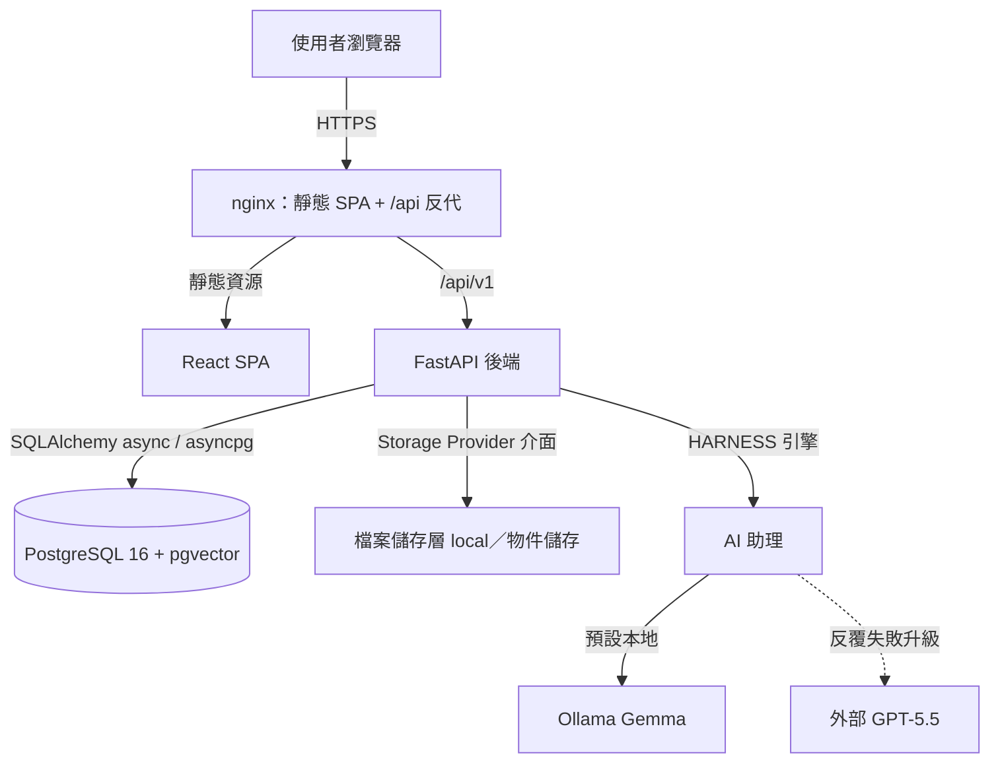
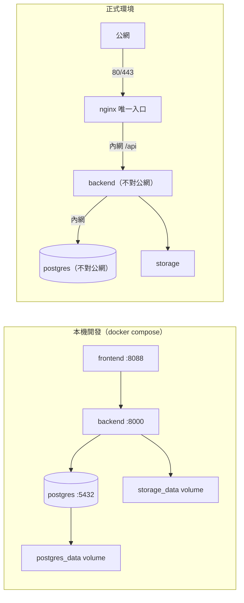
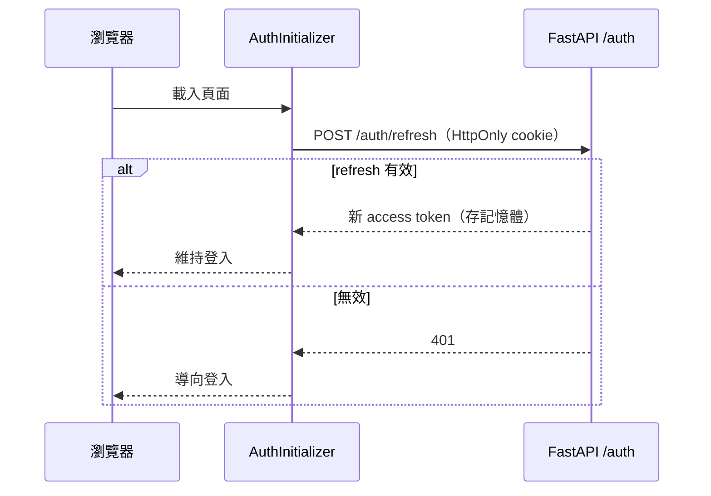
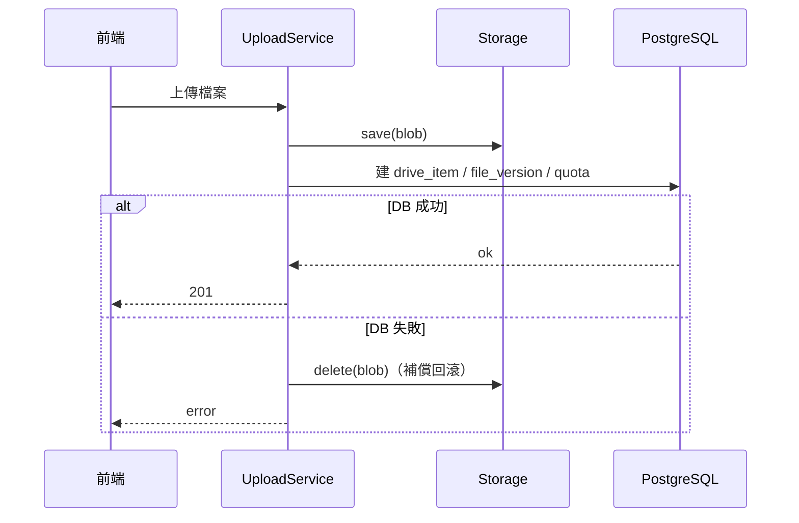
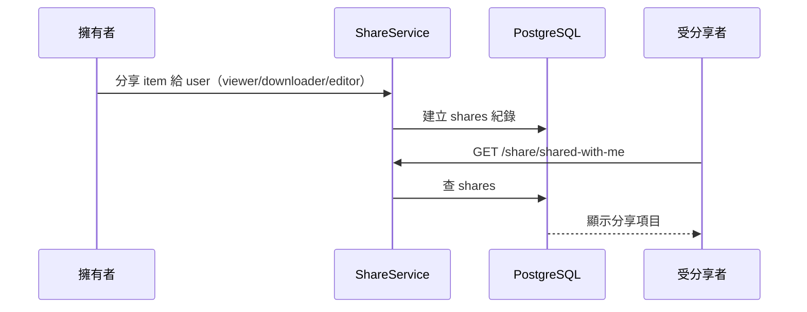
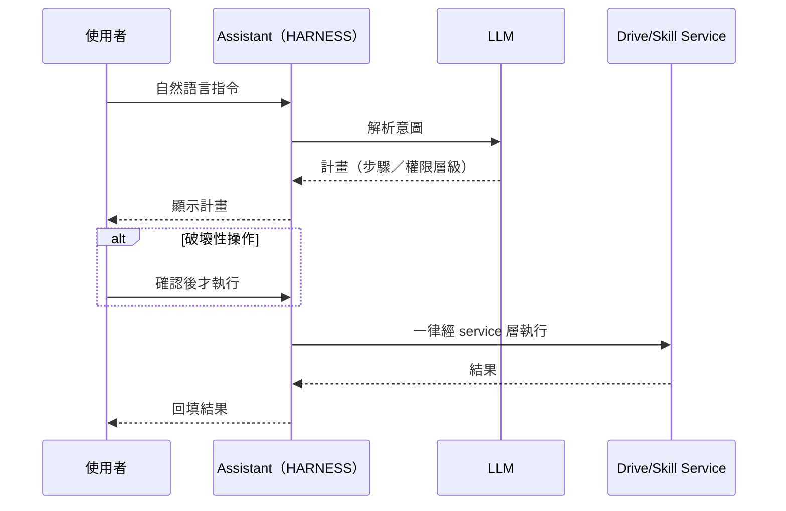
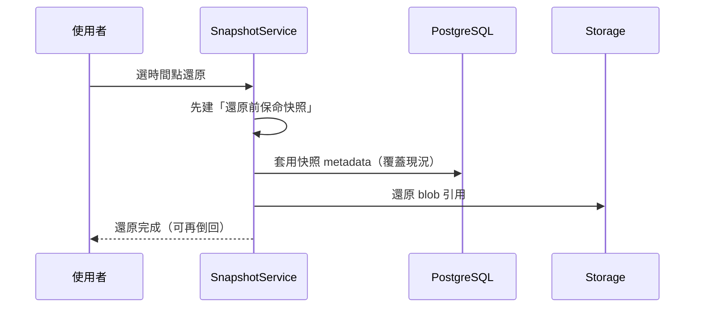
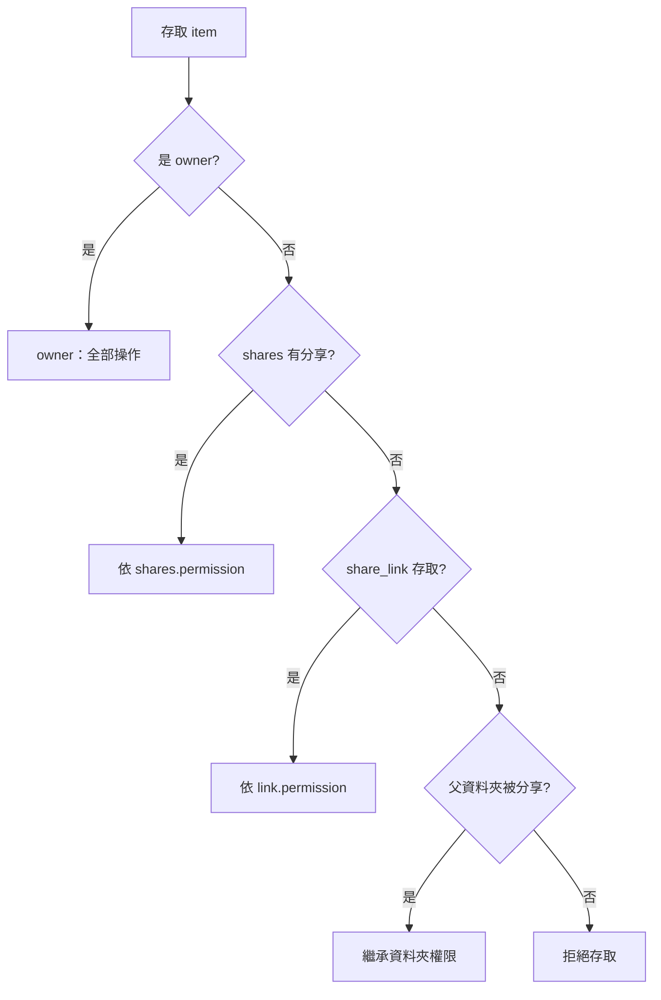
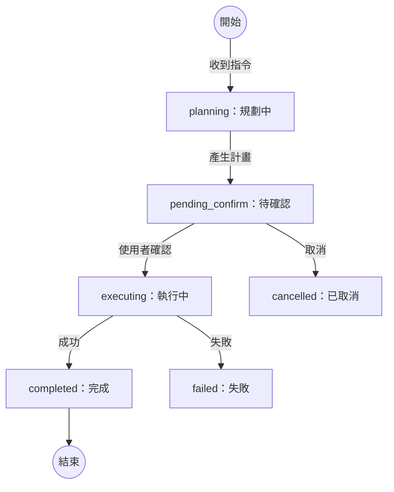
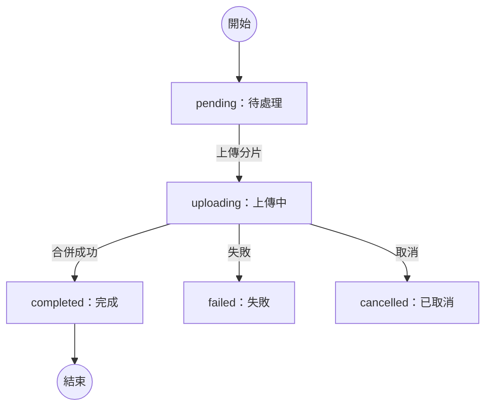

## 3. 整體架構

### 3.1 模組拆分原則與依賴方向

整體系統依下列原則拆分模組，確保各模組職責清楚、相互低耦合、可獨立開發與測試：

1. 每個模組只處理自己的核心責任。
2. Router 不直接操作資料庫。
3. Service 負責商業邏輯與跨 repository 協調。
4. Repository 只負責資料存取。
5. StorageProvider 只負責檔案本體讀寫，不負責資料庫。
6. 權限檢查集中在 PermissionService，不分散在各 router。
7. 容量檢查集中在 QuotaService。
8. 前端 server state 由 TanStack Query 管理。
9. 前端 UI state 由 Zustand 管理。
10. 每個模組都要能用 mock repository 或 mock storage 獨立測試。

模組依賴方向（單向，不可逆）：

```text
Router
  -> Service
    -> Repository
    -> StorageProvider
    -> PermissionService
    -> QuotaService

Repository
  -> PostgreSQL

StorageProvider
  -> Local file system
```

Repository 不可呼叫 Service；StorageProvider 不可呼叫 Repository；前端元件不可直接呼叫 `fetch`，必須透過 api client 或 hook。後端的分層落地細節見 §6 後端核心設計。

### 3.2 後端架構

```text
FastAPI app
  core
    config
    security
    dependencies
    exceptions
  routers
    auth
    users
    drive
    upload
    download
    preview
    search
    share
    trash
  services
    auth
    user
    drive
    permission
    quota
    storage
    upload
    download
    preview
    search
    share
    version
    activity_log
  repositories
    user
    token
    drive_item
    file_version
    share
    share_link
    activity_log
  storage
    base
    local
  models
  schemas
```

### 3.3 前端架構

```text
React app
  app
    router
    providers
  api
    client
    authApi
    driveApi
    uploadApi
    shareApi
    searchApi
  pages
    LoginPage
    RegisterPage
    DrivePage
    SharedWithMePage
    RecentPage
    StarredPage
    TrashPage
  components
    layout
    drive
    upload
    preview
    share
    common
  hooks
    useAuth
    useDriveItems
    useUploadQueue
    useShare
  stores
    authStore
    uploadStore
    uiStore
  types
  utils
```

### 3.4 系統架構圖



> metadata 經 PostgreSQL、檔案 binary 經 Storage Provider，兩者分離（見 §7.9）。

### 3.5 部署圖



> 本機映射 `8000/5432` 僅供開發；正式環境僅 nginx 對外（見 DEC-028）。

### 3.6 核心流程時序圖

**登入後 silent refresh**



**檔案上傳（補償式一致性）**



**分享給指定使用者**



**AI 助理執行 workflow**



**時光機還原**



### 3.7 輔助流程圖

**權限判斷（繼承）**



**AI workflow 狀態機**



**upload session 狀態機**



## 4. 已確認設計決策

| 項目 | 決策 |
| --- | --- |
| 文件覆蓋範圍 | MVP + 第二階段功能 |
| 第三階段功能 | 不納入主詳細設計，只保留擴充介面 |
| 前端狀態管理 | Zustand + TanStack Query |
| UI / 樣式 | shadcn/ui + Tailwind CSS |
| JWT 函式庫 | PyJWT |
| 密碼雜湊 | pwdlib[argon2] |
| 檔案儲存 | StorageProvider 抽象介面 + LocalStorageProvider 第一版實作 |
| 下載接口 | MVP 使用 FastAPI StreamingResponse |
| 大檔案分片上傳 | 不納入核心 detailed design，只保留 UploadSession 擴充點 |
| 分享功能 | 納入分層設計；指定使用者分享先做；公開連結、密碼、到期時間作為第二階段可選 |
| 檔案版本紀錄 | 納入資料表與 service 設計；MVP 可只存 v1 |
| 管理員後台 | 不納入主文件，只保留 role 欄位 |
| 文件語言 | 繁體中文 |

> 上述決策的延伸說明（欄位型別與長度、星號權威來源、metadata/storage 一致性、暴露面與 secret 管理等）已敘述於對應章節（§7.0、§7.3.1、§7.9、§8.9、§21）並彙整於[附錄 A](./appendix-a-decisions.md)（DEC-027、DEC-028），不另立問答清單。
